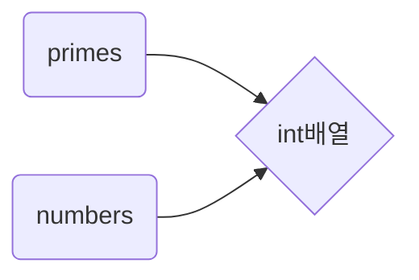
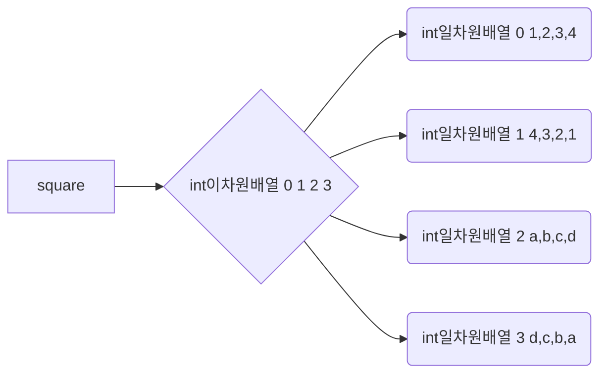

# 1장 기본 프로그래밍 구조

[TOC]

## 1.1 첫 번째 프로그램

### 1.1.1 "Hello, World" 프로그램 파헤치기

```java
package ch01.sec01;

//첫 번째 자바 프로그램

public class HelloWorld {
    public static void main(String[] args) {
        System.out.println("Hello, World!");
    }
}
```

- 자바는 객체 지향 언어 -> 프로그램에서 (대부분) 객체(object)를 조작해 일을 시킴. 각 객체 특정 클래스(class)에 속하며, 그 객체를 클래스의 인스턴스(instance)라고함. 자바는 모든 코드를 클래스 안에 정의함. 
- main은 메서드(method)다. 클래스안에 선언됨 함수. 이 메서드는 객체가 없어도 작동하도록 static으로 선언함.
- 자바의 많은 기능은 public이나 private으로 선언하는데 지정할 수 있음. 가시성 레벨이 두가지 더있음.
- 패키지(pakage)는 관련 있는 클래스를 모아 놓은 집합. 클래스를 패키지 안에 넣어 관련 있는 클래스들을 함께 묶어서 이름이 같은 클래스가 여러 개 있더라도 서로 충돌하지 않게 하면 좋다.
- 주석은 //
- System.out은 자바 프로그램에서 '표준 출력'(standard output)을 나타내는 객체

자바는 몇 가지 명령을 빠르게 실행하려고 사용하는 스크립팅 언어가 아니다. 클래스, 패키지, 모듈로 구조화해 대규모 프로그램을 개발하기 좋은 언어.


### 1.1.2 자바 프로그램 컴파일 및 실행

자바 프로그램을 컴파일하고 실행하려면 JDK(Java Development Kit)(자바 개발 키트)를 설치해야 함. 필요하다면 IDE(Integrated Development Environment)(통합 개발 환경)도 설치한다.  -> 자바 프로그램은 두 단계를 거쳐 실행한다. <u>javac 명령으로 자바 소스 코드를 특정 기계에 종속되지 않은 중간 표현인 바이트코드(byte code)로 컴파일(compile)해서 클래스 파일(class file)에 저장</u>한다. <u>java의 명령으로 가상 머신(virtual machine)을 구동하고 클래스 파일을 로드해서 바이트 코드를 실행</u>한다.

<u>바이트 코드는 한번 컴파일 시 모든 자바 가상 머신에서 실행할 수 있다(특장점인듯). '한 번 작성하고, 어디서나 실행한다.(write once, run anywhere)'는 약속은 자바의 중요한 설계 기준</u>이었음.


### 1.1.3 메서드 호출

`System.out.println("Hello, World!");`

<u>System.out(객체), PrintStream 클래스의 인스턴스, PrintStream 클래스에는 println, print 등 메서드가 있다. 이런 메서드는 해당 클래스의 객체(인스턴스)에서 작동하므로 인스턴스 메서드(instance method)라고 한다.</u>

객체의 인스턴스 메서드 호출법 점(.)표기법(dot notation)을 사용.

<u>자바의 객체 대부분을 생성(construct)해야 한다.</u>

```java
Random generator = new Random();
System.out.println(generator.nextInt());
```

<u>상위 Random문을 사용하기 위해서는 클래스 내에서 import를 해줘야한다.</u>

```java
package ch01.sec01;

import java.util.Random;

public class MethodDemo{
    ...
}
```


### 1.1.4 JShell 실행

-> Java9 부터 제공되지만, low단에서나 쓸거같음.. 그래서 이부분은 필요하면 따로 보는 것으로 하겠음.


## 1.2 기본 타입

자바는 객체 지향 언어지만 모든 값이 객체인 것은 아니다. <u>몇 가지 값은 기본타입(primitive type)에 속한다.</u>


1.2.1 부호 있는 정수 타입

소수점 부분이 없는 숫자를 나타낼 때 사용하며 음수 값도 허용한다.

| 타입  | 저장 공간 | 범위(포함)                                           |
| ----- | --------- | ---------------------------------------------------- |
| byte  | 1byte     | -128~127                                             |
| short | 2byte     | -32,768~32,767                                       |
| int   | 4byte     | -2,147,483,648~,2232,147,483,647(20억 조금 넘어)     |
| long  | 8byte     | -9,223,372,036,854,775,808~9,223,372,036,854,775,807 |

> Note = Integer.MIN_VALUE 상수 가장 작은 정수값, Integer.MAX_VALUE 상수 가장 큰 값 byte, short, long동
>

<u>대부분은 int가 알맞음, 더 큰 값이 있을 때 long사용, byte, short 저수준 파일 처리 등 특수한 응용, 저장공간이 귀할 때 큰 배열 만드는 용도로 사용</u>

> <u>Note = long보다 클 때 BigInteger클래스 사용함.</u>

long 정수 리터럴은 접미어 L을 붙여서 작성함(ex 4000000000000L).

16진수 리터럴에는 접두어 0x를 붙임(ex 0xCAFEBABE). 2진수 값에는 접두어 0b를 붙인다.(ex 2진수 0b1001은 9)

> Caution = 8진수는 접두어 0을 붙임. 8진수 011은 9, 그러나 혼동 줄 수 있으므로 접두어 0을 사용하는 8진수 리터럴은 가급적 이용하지 않는 것이 좋다.
>

<u>숫자 리터럴은 밑줄(_)을 붙일 수 있음. 1_000_000(또는 0b1111_0100_0010_0100_0000)으로 숫자 1,000,000을 나타낼 수 있음. 밑줄은 사람이 구분하는 용도, 컴파일 시 컴파일러가 삭제함.</u>


### 1.2.2 부동소수점 타입

| 타입   | 저장 공간 | 범위                                         |
| ------ | --------- | -------------------------------------------- |
| float  | 4byte     | 약 +-3.40282347E+38F(유효자릿수 6~7)         |
| double | 8byte     | 약 +-1.79769313486231570E+308(유효자릿수 15) |

<u>예전에는 메모리가 부족 4byte 부동소수점 사용하는 것이 일반적, 하지만 소수점 자리 일곱 개로는 많은 것을 표현하지 못하기에 요즘은 '배정밀도(double precision)' 숫자가 기본임. float은 저장할 부동 소수점 수가 많을 때만 사용하는 것이 좋음.</u>

<u>float 타입 숫자에는 접미어 F를 붙임(ex 3.14F). 3.14처름 부동소수점 리터럴에 접미어 f를 붙이지 않으면 double타입이 됨. double타입에는 선택적으로 해도됨(ex 3.14d).</u>

> Note = 부동소수점 리터럴을 16진수로 나타낼 수 있다. 예를 들어 0.0009765625 = 2(-10승)을 0*1.0p-10으로 작성할 수 있다. 16진수 표기법은 지수를 나타낼 때 e가 아니라 p를 사용한다(e는 16진수다). 숫자를 16진법으로 작성하더라도 지수(즉, 2의 거듭제곱을 나타내는 수)는 10진법으로 작성한다는 점을 알아 두자.
>

무한대(뫼비우스의 띠)를 나타내는 Double.POSITIVE_INFINITY, 음의 무한대(-뫼비우스의 띠) Double.NEGATIVE_INFINITY, 숫자가 아님(Not a Number, NaN)을 나타내는 Double.NaN 등 특별한 부동 소수점이 있음. ex 1.0 / 0.0 을 계산한 결과는 양의 무한대임. 0.0 / 0.0 또는 음수의 루트를 계산하면 NaN이 된다.

> Caution = '숫자가 아닌'값은 모두 서로 다른 값으로 간주함. 따라서 if(x == Double.NaN)을 작성해서는 x가 NaN인지 검사할 수 없다. if(Double.isNaN(x))로 작성해야 검사할 수 있다. Double.isInfinite로는 +-뫼비우스의 띠를 테스트하고, Double.isFinite로는 부동소수점 수가 무한대도 아니고 NaN도 아닌지 검사할 수 있다.
>

<u>부동소수점은 금융 계산에 적합하지 않음. System.out.println(2.0 - 1.1) 0.9가 아니라 0.899999999999를 출력함. 이런 반올림 오류가 일어나는 이유는 부동소수점 수를 2진수 체계로 나타내기 때문. 10진수 체계로1/3을 정확히 나타낼 수 없는 것과 같이, 2진수 체계로는 1/10을 정확히 나타낼 수 없다. 임의의 정밀도로 반올림 오류가 없는 정확한 숫자 계산이 필요할 때는 1.4.6 큰 숫자에서 설명하는 BigDecimal클래스 사용해야함.</u>


### 1.2.3 char타입

char타입은 자바가 사용하는 UTF-16 문자 인코딩의 '코드유닛(code unit)'을 나타냄.

\u004A J (ex 점자프로그램을 만들 시 한글을 초,중,종성으로 나누어 UTF-16 인코딩 방식을 이용해 점자신호를 지정할 수 있음.-> 잘안써)

특수코드 \n, \r, \t, \b는 각각 라인피드(line feed)(줄 넘김), 캐리지 리턴(carriage return)(출력 위치를 줄 맨 앞으로 이동), 탭(tab), 백스페이스(backspace)를 나타낸다.

작은 따옴표(')와 백슬래시 자체("\")를 나타낼 때는 백슬래시 로 이스케이스(excape)한다.(\', "\'\")


### 1.2.4 boolean타입

boolean 타입 값은 false와 true 두 개 뿐이다. 자바에서 boolean은 숫자 타입이 아님. 즉 boolean값과 정수인 0, 1 사이에는 아무련 관련이 없다.

---

## 2018.12.01 발표

## 1.3 변수

변수와 상수의 선언, 초기화하는 방법을 배워보자

### 1.3.1 변수 선언

<u>자바는 타입 결합이 강한 언어. 각 변수에는 해당 타입 값만 저장할 수 있음. 변수 선언 시 타입과 이름을 지정해야 하며, 필요하면 초기값을 지정할 수 도 있다.</u>

```java
int total = 0;

//타입이 같은 변수 여러 개를 한 문장으로 선언할 수 있다.
int total = 0, count;// count는 초기화되지 않은 정수 == int count;

//자바 개발자 대부분은 각 변수를 개별로 선언하는 것 선호함.
Random generator = new Random();
```

### 1.3.2 변수 이름

변수 이름은 반드시 문자로 시작해야함(메서드와 클래스 동일). 변수 이름은 문자, 숫자, 기호 \_와 \$로 구성할 수 있다. 하지만 \$로 구성할 수 있다. 하지만 \$는 자동으로 생성되는 이름용이므로 직접 이름을 지을 때는 사용하지 말아야 함. 마지막으로 _자체는 유효한 변수 이름이 아니다. -> 자바8에서는 \_사용시 에러냈으나, 자바9에서는 예약어로 제외시킴.

예약어도 변수이름으로 사용할 수 없음. 기본이 낙타법(ex public void initSettingForViewGroup...)

### 1.3.3 변수 초기화

<u>메서드 안에 변수를 선언했다면 해당 변수를 반드시 초기화한 후 사용</u>해야 한다.

```java
int count;
count++; //오류 - 초기화되지 않은 변수를 사용함.

//컴파일러는 변수 사용전 초기화 검증함.
int count;
if(total==0){
    count = 0;
} else {
    count++; //else 구문으로 빠질 시 count는 초기화되지 않았다.
}
```

메서드 안에서는 어느 위치에나 변수를 선언할 수 있다. -> <u>자바에서는 변수를 사용하기 직전까지 변수 선언 시기를 늦추는 것을 좋은 방식으로 여긴다.</u>

```java
Scanner in = Scanner(System.in); // 1.6.1 입력 읽어 오기 참고
System.out.println("how old are you?");
int age = in.nextInt();
```

여기서는 변수를 변수의 초깃값으로 사용할 값을 얻는 시점에 선언했다.

### 1.3.4 상수

final 키워드 한번 할당하면 변경할 수 없는 값에 사용 -> 다른언어에서 이 값을 **상수**라고 함.

`final int DAYS_PER_WEEK = 7;`

상수 이름은 대문자로 선언(관례), 다음과 같이 static을 사용하여 외부에 선언할 수 있음.

```java
public class Calendar {
    public static final int DAYS_PER_WEEK=7;
    ...
}
```

<u>메모리에 올려놓기 때문에 여러 메서드에서 사용가능</u>함. Calendar.DAYS_PER_WEEK

final 변수를 처음 사용하기 전에 딱 한번만 초기화한다면 초기화를 나중으로 미룰 수도 있다.

```java
final int DAYS_IN_FEBRUARY;
if(leapYear){
    DAYS_IN_FEBRUARY = 29;
} else {
    DAYS_IN_FEBRUARY = 28;
}
```

> Note = 상수의 집합이 필요할때는 열거타입(enumerated type)을 정의하면 된다.
>
> `enum Weekday{MONDAY, TUESDAY, WEDNESDAY, THURSDAY...};`


이렇게하면 Weekday는 Weekday.MONDAY등을 가지는 타입이 된다.

초기화법 => Weekday startDay = Weekday.MONDAY; -> 추가설명은 4장 상속과 리플렉션에서 설명


## 1.4 산술 연산

연산자(결합방향 중요)

| 연산자                                   | 결합 방향 |
| ---------------------------------------- | --------- |
| [] . () 메서드 호출                      | 왼쪽      |
| ! ~ ++(단항) -(단항) ()(캐스트) new      | 오른쪽    |
| * / %                                    | 왼쪽      |
| + -                                      | 왼쪽      |
| << >> >>>(산술 시프트)                   | 왼쪽      |
| < > <= >= instanceof                     | 왼쪽      |
| == !=                                    | 왼쪽      |
| &(비트곱)                                | 왼쪽      |
| ^(배타적 비트합)                         | 왼쪽      |
| \|(비트합)                               | 왼쪽      |
| &&(논리곱)                               | 왼쪽      |
| \|\|(논리합)                             | 왼쪽      |
| ? : (조건부)                             | 왼쪽      |
| = += -+ \*= /= %= <<= >>= >>>= &= ^= \|= | 오른쪽    |

> Note = 상위 표는 우선순위에 따라 내림차순으로 연산자 나열함. ex) +가 <<보다 우선순위가 높음. 3+4<<5의 값은 (3+4)<<5
>
> 연산자가 왼쪽에서 오른쪽으로 묶일 때는 왼쪽으로 결합함. ex) 3-4-5 = (3-4)-5, i-=j-=k == i-=(j-=k)

### 1.4.1 할당 

​	`int a = 10;` =은 할당 연산자

### 1.4.2 기본계산

<u>/를 사용할때는 주의해야함. 두 피연산자가 정수 타입이면 정수 나눗셈을 의미해 나머지를 버림.</u>

17.0/5 = 3.4 가 수학적 표현이지만, 17/5는 3으로 도출됨.

<u>모든 정수를 0으로 나누면 예외가 일어남</u>(5장 예외, 단정, 로깅에서 자세히 설명). <u>부동소수점을 0으로 나누면 예외가 일어나지 않고, 결과가 무한대 값이나 NaN이 나옴</u>(1.2.2 부동소수점 타입 참고).

% 연산자는 나머지를 돌려준다. ex) 17%5의 값은 17에 가장 가까운 5의 최대 배수를 뺀 나머지 2임. a%b의 나머지가 0이라면 a는 b의 정수배임.

%는 흔히 정수의 홀짝 검사에 이용함. 홀수일때는 1(양수), -1(음수)로 도출할 수 있음.

```java
//시침 초침계산 시
(position + adjustment) % 12;

//그러나 adjustment시침이 음수 일 때
((position+adjustment)%+12)%12

// 이러한 상황에서는 Math.floorMod 메서드 이용이 간편함.
Math.floorMod(position + adjustment, 12);
	//언제나 0~11사이의 값을 줌.
```

자바는 증가 감소 연산자 있음.

n++; n에서 1을 더한다.

n--;	n에서 1을 뺀다.

n++ 증가 이전값을

++n 증가 이후 값을 돌려줌.

arg를 args[n] 값으로 설정한 후 n을 증가시킴.

`String arg = arg[n++];`

컴파일러의 최적화문제로인해 30년전에는 일리가 있음. 하지만 요새는 두 문장으로 나눈 형태를 읽기 쉽다고함.

> Note = <u>자바의 목표는 이식성(portability), 즉 어떤 가상 머신에서 실행해도 계산 결과가 같아야함</u>. 많은 최신 프로세스는 64비트보다 <u>큰 부동소수점 레지스터를 사용해 계산 과정에서 발생할 수 있는 오버플로 위험을 줄이고 부동소수점의 정밀도를 높임</u>.  자바는 이런 최적화를 허용. -> 그렇지 않을 시 부동소수점 연산이 느려지고, 덜 정확할 수 있기 때문. 이런 문제에 초점을 맞추어 <u>strictfp라는 제어자(modifier)를 제공</u>함. <u>제어자를 추가하면 해당 메서드의 부동소수점 연산은 전체 플랫폼에서 **같은 결과를 반환**</u>-> 이식성이 높아짐.

### 1.4.3 수학 메서드

자바에는 숫자를 제곱수로 만드는 연산자가 없음. 그 대신 Math.pow메서드 호출하면됨. Math.pow(x, y)는 x의 y제곱을 돌려줌. x의 제곱근을 계산하기 위해서는 Math.sqrt(x)를 호출 하면됨.

 <u>이 메서드들은 정적(static)메서드이므로 객체(인스턴스)로 호출 할 수 없음.</u>

> Note = Math클래스에는 정수를 더 안전하게 계산하는 여러 메서드가 있음. <u>수학 연산자는 계산이 오버플로되면 틀린 결과를 반환함. ex 10억 곱하기 3은 -1294967296으로 계산됨.</u> int값이 2억을 겨우 넘기때문. <u>반면 Math.multiplyExact(100000000, 3)을 호출하면 예외가 일어남</u> -> 이 메서드로 틀린 결과를 반환하는 대신 예외를 잡아내거나 프로그램을 종료할 수 있음. 이외에도 addExact, subtractExact, incrementExact, decrementExact, negateExact 메서드가 있음. 모두 int와 long 매개변수 버전을 제공. 

 몇 가지 수학 메서드는 다른 클래스가 들어 있음. ex) Integer와 Long클래스에는 부호 없는 값을 다루는 compareUnsigned, divideUnsigned, remainderUnsigned메서드가 있음.

 덜 효율적이나 결과가 동일한 부동 소수점 계산을 원한다면 수학 메서드를 엄격하게 구현한 StrictMath클래스를 사용함.

### 1.4.4 숫자 타입 변환

연산자에 사용한 피연산자와 숫자 타입이 다르면 숫자를 공통 타입으로 변환한 후 결합

순서

1. 피연산자 중 하나가 double타입이면 다른 하나를 double로 변환함.
2. 피연산자 중 하나가 float타입이면 다른 하나를 float로 변환함.
3. 피연산자 중 하나가 long타입이면 다른 하나를 long으로 변환함.
4. 이외에는 두 피연산자를 int로 변환.

ex) 3.14+42를 계산할때 두번째 피연산자를 42.0으로 변환한 후 합계 계산함 -> 45.14

​	'J'+1 char값 'J'를 int값 74로 변환하게 되면, 75가 됨.

​	double x = 42; int값 42를 double값으로 변환함.

<u>자바에서 정보손실이 없다면 합법적인 변환으로 간주함.</u> 

- byte에서 short, int, long, double로 변환
- short와 char에서 int, long, double로 변환
- int에서 long, double로 변환

정수 타입을 부동소수점 타입으로 변환하는 것은 언제나 합법적.

> **Caution 다음 변환은 합법적이지만 정보를 잃을 수도 있다.**
>
> - **int에서 float로 변환.**
> - **long에서 float, double로 변환**
>
> **다음 할당문 float f = 123456789;**
>
> **float의 유효자릿수가 약 일곱 개이므로 실제로 f는 1.23456792E8이 됨.**

이렇게 허용되는 것을 제외하고 강제로 변환을 수행할 때는 캐스트 연산자(대상 타입의 이름을 괄호 안에 넣은 형태)를 사용

```java
double x = 3.75;
int n = (int) x;
```

이렇게 작성하면 소수부는 버리고 n을 3으로 설정

타입 변환 대신 가장 가까운 정수로 반올림하고 싶을 때는 Math.round메서드를 사용함. 이 메서드는 long타입 값을 반환함. 답이 int 범위 안에 들어간다는 사실을 알고 있을 때는

`int n = (int) Math.round(x);`

x는 3.75이므로 n은 4가 됨. 정수타입을 바이트수가 더 적은 정수 타입으로 변환할 때도 캐스트를 사용.

```java
int n = 1;
char next = (char)('J'+n);//75를 'K'로 변환함.
```

더 작은 정수타입으로 캐스트하면 하위 바이트들만 보존됨.

int n = (int)3000000000L; n을 -1294967296으로 설정함.

> Note = 캐스트로 주요 숫자 부분이 사라질 것이 염려된다면 캐스트 대신 Math.toIntExact메서드 사용 -> 이 메서드는 long을 int로 변환할 수 없을 때 예외 발생.

### 1.4.5 관계 연산자와 논리 연산자

==, != 연산자는 동등성(equality)를 검사함. <, >, <=, >=연산자도 있음.

boolean타입 표현식은 &&, ||, ! 연산자와 결합가능

<u>ex) 0 <= n && n < length -> 첫번째 조건이 false면 두번째 조건은 평가하지 않음(단락 평가(short circuit evaluation)는 두번째 조건이 오류를 일으킬 가능성이 있을 때 유용)</u>

`n != 0 && s + (100-s) / n < 50`

n이 0이라면 n으로 나누는 두번째 조건은 절대로 평가하지 않으므로 오류 X

&&(두개 다) 그리고 ||(둘 중 하나)또는

마지막 조건(conditional)연산자는 피연산자가 세개(조건 한개와 값 두개)인 연산자. 조건이 true면 첫번째값이 결과 false면 두번째값이 결과 

```java
time < 12 ? "am" : "pm"
```

> Note = 논리 연산자와 관련 있는 비트 단위(bitwise) 연산자는 &(and, 비트곱), |(or, 비트합), ^(xor, 배타적 비트합)이 있음. 비트 단위 연산자는 정수의 비트 패턴에 적용. ex) 0xF는 이진 숫자로 0...011111이므로 n&0xF는 n의 최하위 비트 네개를 돌려줌. ....... 설명이 매우 어렵고 추가 공부필요한거 같아서 생략하고 저자가 설명한 부분 중 가장 귀에 들어오는 말을 적습니다............. <u>프로그램에서 비트 조작을 수행한다면 그 조작이 무엇을 의미하는지 알아야하는데, 잘 모른다면 이런 연산자를 사용하지 말아야 함.</u>

> Caution = 시프트 연산자의 오른쪽 인수는 왼쪽 인수가 int면 32로 나눈 나머지가 되고, long이면 64로 나눈 나머지가 됨. ex) 1 << 35의 값은 1 << 3, 즉 8과 같음.

> Tip = &와 | 연산자를 boolean 값에 적용하면 결과를 결합하기 전에 두 피연산자를 강제로 평가함. 그런데 이런 식으로 사용하는 경우는 흔하지 않음. 오른쪽 피연산자에 부가 작용이 없을 때는 실제로 덜 효율적이라는 점을 제외하면 &&와 ||처럼 동작함. 두 번째 피연산자를 강제로 평가해야 할 때는 값을 boolean변수에 할당해서 실행 흐름을 있는 그대로 볼 수 있게 하면 좋다.

### 1.4.6 큰 숫자

기본 정수 타입이나 부동소수점 타입의 정밀도로 충분하지 않을 때는 java.math 패키지의 **BigInteger**와 **BigDecimal**클래스를 사용하면 됨. <u>이 클래스의 객체는 임의 길이로 연속된 수를 나타냄.</u>

- BigInteger 클래스는 임의로 정밀도 정수 연산을 구현

- BigDecimal 클래스는 부동소수점 수에 동일 동작을 구현함.

- <u>정적 메서드 valueOf는 long을 BigInteger로 변환함</u>.

  `BigInteger n = BigInteger.valueOf(87865415643434684L);`

- <u>숫자로 구성된 문자열에서 BigInteger를 생성가능</u>

  `BigInteger k = new BigInteger("4734984984389349834");`

- BigInteger에 미리 정의된 상수로는 BigInteger.ZERO, BigInteger.ONE, BigInteger.TWO, BigInteger.TEN이 있다.

- <u>자바에서는 객체에 연산자를 사용할 수 없다. 따라서 큰 숫자를 다룰 때는 반드시 메서드를 호출해야함.</u>

  `BigInteger r = BigInteger.valueOf(5).multiply(n.add(k));//r=5*(n+k)`

- 1.2.2 부동소수점 타입에서 뺄셈 2.0-1.1의 결과 0.899999999999999999999가 되는 현상이 있었음. <u>BigDecimal 클래스를 이용하면 결과를 정확하게 도출할 수 있음.</u> BigDecimal.valueOf(n, e)를 호출하면 값이 n x 10(-e승(제곱))인 BigDecimal 인스턴스를 반환한다.

  `BigDecimal.valueOf(2, 0).subtract(BigDecimal.valueOf(11, 1))`

  본 코드의 호출 결과는 정확하게 0.9가 됨.

---

## 2018.12.15 발표

## 1.5 문자열

<u>문자열은 문자의 시퀀스(연속)</u>임. <u>자바에서는 유니코드 문자라면 무엇이든 문자열에 쓸 수 있다.</u>

### 1.5.1 문자열 연결

너무 당연한 이야기를 해서 안적습니다.

여러 문자열을 구분자로 구분해서 결합할 때는 **join 메서드**를 사용한다.

```java
String names = String.join(", ", "Peter", "Paul", "Mary");
//names의 결과는 "Peter, Paul, Mary"
```

첫번째 인수가 분리 문자열

<u>최종결과만 필요한 상황인데도 수많은 문자열을 연결하는 것은 다소 비효율적 -> **StringBuilder**사용</u>

```java
StringBuilder builder = new StringBuilder();
while(문자열이 있을때){
    builder.append(다음 문자열);
}
String result = builder.toString();
```

### 1.5.2 부분 문자열

문자열 분리 시 **substring** 메서드 사용

```java
String greeting = "Hello, World!";
String location = greeting.substring(7, 12); //결과값 World로 설정
```

substring메서드의 첫번째 인수는 추출할 부분 문자열(substring)의 시작위치

<u>문자열에서 부분 문자열을 구분자(delimiter)로 분리해서 모두 추출해야 할 때도 있음. **splite**메서드 사용.</u>

```java
String names = "Peter, Paul, Mary";
String[] result = names.split(", ");
//결과값 ["Peter", "Paul", "Mary"]
```

어떤 정규 표현식(9장 입출력 처리 참고)이든 분리자(separator)로 사용할 수 있다. 예를 들어 input.split("\\\s+")는 input을 공백으로 분리한다.

### 1.5.3 문자열 비교

<u>두 문자열이 같은지 검사하려면 **equals 메서드**를 사용</u>해야 한다.

`location.equals("World")` -> location이 "World"면 true 반환해줌.

> Caution = **<u>문자열을 비교할 때는 절대로 == 연산자를 사용하면 안됨.</u>**
>
> `location == "World"` 은 안되
>
> <u>String의 경우 이런식의 비교는 location과 "World"가 **메모리에서 동일 객체일 때만 true를 반환함**. 가상 머신에는 각 리터럴 문자열의 인스턴스가 오직 한개씩 있으므로 "World"=="World"로 비교해야 true가 됨.</u>
>
> <u>만약 location이 다음과 같이 계산된 문자열이라고 하면</u>
>
> <u>`String location = greeting.substring(7, 12)`</u>
>
> <u>**결과가 별도의 String객체에 저장되고, location == "World" 비교는 false를 반환한다.**</u>

다른 모든 객체 타입 변수와 마찬가지로 <u>String 변수는 어떤 객체(심지어 빈 문자열)도 참조하지 않는 null이 될 수 있음.</u>

`String middleName = null;`

객체의 null 검사는 ==연산자를 사용해야 한다.

`if(middlename == null) ...`

**<u>null은 빈 문자열("")과 다르다(빈 문자열은 길이가 0, null은 아예 문자열이 아님)</u>**

> Caution = null 메서드 호출 시 '널 포인터 예외(NullPointerException)'이 일어남. 예외처리 명시적 안하면 프로그램 종료됨.

> Tip = <u>문자열을 리터럴 문자열과 비교할 때 리터럴 문자열을 앞쪽에 두는 것이 좋다.</u>
>
> `if("World".equals(location))..`
>
> 이 검사 location이 null일 때도 제대로 작동함.

대.소문자 구별하지 않고 두 문자열 비교 **equalsIgnoreCase**

`"world".equalsIgnoreCase(location);`

문자열 순서대로 정렬 compareTo

`first.compareTo(second)`

---

????????????????

이 호출은 first가 second보다 앞에 오면 음의 정수(꼭 -1은 아님)를 반환하고, first가 second보다 뒤에 오면 양의 정수(꼭 1은 아님)를 반환, 두 문자열이 같으면 0을 반환함.

`"World".compare("Word") => 8` 

`"Word".compare("World") => -8`

<u>유니코드 값의 차이를 반환</u>한다. 이 비교는 문자의 유니코드 값에 의존하므로 사람에게는 직관적이지 않다.

????????????????????

---

> Tip = 사람이 읽을 수 있는 문자열을 정렬할 때는 언어 고유의 정렬 규칙을 알고 있는 <u>Collator객체를 사용</u>

### 1.5.4 숫자와 문자열 사이의 변환

정수 문자열 변환 시 정적 메서드 Integer.toString을 호출

~~이 메서드의 변형은 두 번째 매개변수로 기수(2~36)를 받는다.~~

2진수로의 변환

```java
int n = 42;
String str2 = Integer.toString(n, 2); // 101010출력
```

> Note = 정수를 문자열로 변환하는 더 간단한 방법 ""+n처럼 빈문자열 연결, *but 일부 프로그램에서는 보기 좋지 않다는 이유로 지양함. 효율성도 떨어짐 <- 필자의 생각*

위 논리의 반대도 가능함 String -> Integer로의 변환

Integer.parseInt사용

### 1.5.5 문자열 API

수많은 메서드가 있지만, 그 중 유용한 것만 간추림 -> 그냥 한번 보세요

| 메서드                                                       | 목적                                                         |
| ------------------------------------------------------------ | ------------------------------------------------------------ |
| boolean startsWith(String str)                               | 문자열이 지정한 문자열로 시작.종료하거나 지정한 문자열을 포함하는지 검사한다. |
| boolean endsWith(String str)                                 | ""                                                           |
| boolean contains(CharSequence str)                           | ""                                                           |
| int indexOf(String str)                                      | 전체 문자열이나 fromIndex에서 시작하는 부분 문자열을 검색해 str이 처음 또는 마지막으로 나타난 위치를 얻는다. 일치하는 부분을 찾지 못하면 -1을 반환한다. |
| int lastIndexOf(String str)                                  | ""                                                           |
| int indexOf(String str, int fromIndex)                       | ""                                                           |
| int lastIndexOf(String str, int fromIndex)                   | ""                                                           |
| String replace(CharSequence oldString, CharSequence newString) | OldString이 나타난 부분을 모두 newString으로 교체한 문자열을 반환 |
| String toUpperCase()                                         | 원본 문자열의 모든 문자가 대문자 또는 소문자로 변환된 문자열을 반환 |
| String toLowerCase()                                         | ""                                                           |
| String trim()                                                | 앞뒤 공백을 모두 제거한 문자열을 반환함.                     |

<u>*String 클래스는 불변(immutable)이라는 점을 유의*</u> -> **String클래스의 어떤 메서드도 해당 문자열 자체를 변경할 수 없다.**  => 그래서 **<u>상수관리</u>**가 필요하다.

ex)안드로이드 value/string.xml 에서 map(키와 값)저장 방식으로 상수관리(자원관리)함.

```java
String greeting = "Hello World!!";
greeting.toUpperCase(); //greeting을 변경하지 않고, "HELLO, WORLD!!"라는 새 문자열 반환
```

또 일부 메서드는 CharSequence타입 매개변수를 받는다는 점도 유의 -> <u>CharSequence는 String, StringBuilder, 다른 문자 시퀀스의 공통 슈퍼타입(supertype)임.</u>

자세한 설명은 [여기](http://docs.oracle.com/javase/10/docs/api)에 접속한 후 온라인 자바 API문서를 살펴보자. 자세한 건 문서에 나와있음.(영문)

### 1.5.6 코드 포인트와 코드 유닛

**인코딩의 문제점의 원인**

자바 만들 당시부터 유니코드 표준을 수용했음. *유니코드 표준은 문자 인코딩 문제를 해결할 목적으로 개발*됨. 유니코드 이전에는 서로 호환되지 않는 문자 인코딩이 많았음. 영어는 거의 모두가 7bit ASCII로 표준화하는데 동의했음(7bit 아스키는 모든 영문자, 숫자,다양한 기호에 0~127 사이의 코드를 할당). 서유럽 악센트가 붙은 문자를 포함하는 8bit 코드로 아스키 확장. 러시아는 128~255 위치에 키릴 문자 할당하도록 아스키 확장. 일본은 가변 길이 인코딩을 사용해 영어와 일본어 문자를 인코딩했음. => 서로다른 인코딩으로 된 파일을교환하는 일이 큰 문제가 되었음.

**유니코드와 자바**

 유니코드는 모든 문자 표기 체계의 각 문자에 0~65535 사이의 유일한 16bit 코드를 할당하는 방법으로 이 문제를 해결하기 시작. **자바는 처음부터 16bit 유니코드 문자를 사용하도록 설계**함. 하지만 문자가 예상보다 훨씬 많아(중국어 표의 문자) **16bit를 넘게되었음.**

 현 유니코드는 21bit를 요구, 유효한 유니코드 값을 **코드 포인트**(code point)라고 함. ex) A문자의 코드 포인트는 U+0041이고, [팔원수 집합](http://math.ucr.edu/home/baez/octonions)을 나타내는 수학기호 //수학기호//의 코드 포인트는 U+1D546임.

 <u>UTF-16은 길이가 가변적, 하위 호환성을 지원하는 인코딩</u> -> 모든 '전통적인' 유니코드 문자를 16bit 값 한 개로 나타내고, U+FFFF를 넘는 문자는 '대용 문자(surrogate character)'라는 코드 공간의 특별한 영역에서 가져온 16bit 값의 쌍으로 나타냄. 이 인코딩으로 A문자는 \\u0041이고, //팔원수 집합 수학기호//\\ud835\\udd46

 자바는 16bit에서 21bit로 옮겨 가던 중간 시기에 생겨나 어려움을 겪었음. -> 자바 문자열은 유니코드 문자(코드 포인트)의 원래 시퀀스가 아닌 UTF-16으로 인코딩된 16bit 숫자인 **코드유닛** 시퀀스임.

 if(중국어 표의 문자를 신경 쓸 필요가 없고 &&팔원수 집합 수학기호 같은 특수 문자를 버릴 용의가 있을때)

​	String이 유니코드 문자의 시퀀스라고 가정해도 됨

 i번째 문자를 다음과 같이 얻을 수 있음.}

```java
char ch = str.charAt(i);

//문자열의 길이
int length = str.length();

//문자열 제대로 처리하려면 더 많은 작업 필요 i번째 유니코드의 코드 포인트 얻기 위해서는
int codePoint = str.codePointAt(str.offsetByCodePoints(0,i));

//코드 포인트의 총수
int codePointLength = str.codePintCount(0, str.length());

//다음 루프는 코드 포인트 순차적 추출
int i = 0;
while(i < s.length()) {
    int j = s.offsetByCodePoints(i, 1);
    String codePoint = s.substring(i, j);
    ...
    i = j;
}
```

 코드 포인트당 int 값 한 개로 구성된 int 값의 **스트림**(stream)을 반환하는 codePoints메서드를 사용하는 다른 방법도 있음. -> 8장 스트림에서 자세히 설명

 다음 방법으로 스트림을 배열로 변환할 수 있음.

`int[] codePoints = str.codePoints().toArray();`

> Note = 과거에는 내부적으로 항상 UTF-16 인코딩을 사용해 char값의 배열로 문자열을 표현했음. 요즘 String 객체는 가능하면 ISO-8859-1문자의 바이트 배열을 사용. => 자바의 차기 버전은 내부적으로 UTF-8을 사용하도록 바뀔 수도 있다. 그럴수도 있다는 저자의 생각인듯

## 1.6 입력과 출력

 터미널 입력을 읽고 포맷 적용 출력을 만들어 봅시다

### 1.6.1 입력 읽어 오기

System.out.println을 호출시 *'표준 출력 스트림(standard output stream)'*으로 전달되어 터미널에 표시됨. 반면에 *'표준입력 스트림(standard input stream)'*에서 읽기는 그리 쉽지 않음. 표준 입력 스트림에 대응하는 System.in 객체에는 바이트 한 개를 읽어 오는 메서드만 있기 때문. 문자열과 숫자를 읽으려면 System.in에 연결된 Scanner를 생성해야 함.

```java
Scanner in = new Scanner(System.in);

//nextLine 메서드는 입력을 한 줄 읽음.
System.out.println("What is your name?");
String name = in.nextLine();

/*이 예제에서는 입력이 공백을 포함할 수 있으므로 nextLine메서드를 사용하면 좋음. 공백으로 구분된 단어 한 개를 읽으려면 다음과 같이 호출.*/
String firstName = in.next();

//정수를 읽으려면 nextInt 메서드 사용
System.out.println("How old are you?");
int age  = in.nextInt();

// 위와 유사하게 nextDouble메서드는 다음 번 부동소수점 수를 읽음.
/*또다른 줄(hasNextLine), 단어(hasNext), 정수(hasNextInt), 부동소수점 수(hasNextDouble)메서드 사용하면 됨.*/

if(in.hasNextInt()) {
    int age = in.nextInt();
    //...
}
```

Scanner클래스는 java.util 패키지에 있음. 본 클래스 사용을 위해서는 import를 해야되는데 대부분의 IDE는 자동으로 해줄거임.


> Tip = Scanner 클래스는 사용하면 입력 내용이 터미널에 보이므로 비밀번호를 읽을 때는 쓰지 말아야 함. 비밀번호를 읽을 때는 Scanner 대신 Console클래스를 사용 
>
> ```
> Console terminal = System.console();
> String username = terminal.readLine("User name: ");
> char[] passwd = terminal.readPassword("password: ");
> ```
>
> readPassword로 입력을 읽으면 비밀번호가 문자 배열로 변환됨. 문자 배열은 비밀번호를 사용한 후 덮어쓸 수 있으므로 비밀번호를 String에 저장하는 것보다 더 안전하다.

> Tip = 파일에서 입력을 읽어 오거나 파일에 출력을 쓸 때는 셸(shell)의 입출력 재지정(redirection)문법을 사용한다.
>
> `java mypackage.MainClass <input.txt> output.txt`
>
> 이제 System.in은 input.txt에서 입력을 읽어 오고, System.out은 output.txt에 출력을 쓴다. 9장 입출력 처리에서 더 일반적인 파일 입출력 방법을 설명함.

### 1.6.2 포멧 적용 출력

println말고 줄넘김을 하지 않는 print 메서드도 있다. 입력 프롬프트를 표시할 때 사용한다.

숫자의 개수를 제한하려면 printf 메서드를 사용함.

`System.out.printf("%8.2f", 1000.0 / 3.0);`

**포맷 문자열**(format string) **"%8.2f"**는 부동소수점 수를 **필드폭**(field width)은 8자리로 출력하고, **정밀도**(precision)는 2자리로 출력한다. 출력 결과는 앞쪽 빈칸 두 개와 문자 여섯 개

  333.33 (스페이스 두개) 총 8칸

printf에 매개변수를 여러 개 지정할 수도 있다.

`System.out.printf("Hello, %s. Next year, you'll be %d.\n", name, age);`

%문자로 시작하는 **포맷 지정자**(format specifier)는 각각에 대응하는 인수로 교체됨. 포맷 지정자 끝에 오는 **변환 문자**(conversion character)는 포맷이 적용될 값의 타입을 나타냄. ex) f는 부동소수점 수를 나타내고, s는 문자열을 나타내며, d는 10진 정수를 나타냄. 

모든 변환 문자 정리

| 변환문자 | 목적                                                         | 예                                                      |
| -------- | ------------------------------------------------------------ | ------------------------------------------------------- |
| d        | 10진 정수                                                    | 159                                                     |
| x 또는 X | 16진 정수                                                    | 9f 또는 9F                                              |
| o        | 8진 정수                                                     | 237                                                     |
| f        | 고정 부동소수점                                              | 15.9                                                    |
| e 또는 E | 지수 부동소수점                                              | 1.59e + 01 또는 1.59E+01                                |
| g 또는 G | 일반 부동소수점. 지수가 정밀도보다 크거나 -4보다 작을 때는 e/E, 그렇지 않으면 f/F | 기본 정밀도가 6일 때는 15.9000, 정밀도가 1일 때는 2e+01 |
| a 또는 A | 16진 부동소수점                                              | 0x1.fccdp3 또는 0X1.FCCDP3                              |
| s 또는 S | 문자열                                                       | Java 또는 JAVA                                          |
| c 또는 C | 문자                                                         | j 또는 J                                                |
| b 또는 B | boolean                                                      | false 또는 FALSE                                        |
| h 또는 H | 해시 코드(4장 상속과 리플렉션 참조)                          | 42628b2 또는 42628B2                                    |
| t 또는 T | 날짜와 시간(이제 사용하지 않음. 12장 날짜와 시간 API 참고) **9버전 기준** | -                                                       |
| %        | 퍼센트(백분율)기호                                           | %                                                       |
| n        | 플랫폼별 줄 분리자                                           | -                                                       |

하위 표에서는 포맷 적용 출력용 플래그를 정리, 다음 코드에서 콤마 플래그(,)는 그룹 분리자로 추가하고 +는 숫자에 부호를 붙임.

`System.out.printf("%, +.2f", 100000.0 / 3.0);` -> 결과 +33,333.33

| 플래그          | 목적                                                         | 예         |
| --------------- | ------------------------------------------------------------ | ---------- |
| +               | 양수와 음수 부호를 출력한다.                                 | +3333.33   |
| 빈칸            | 양수 앞에 빈칸(스페이스)을 추가한다.                         | \-3333.33  |
| -               | 필드를 왼쪽 정렬한다.                                        | 3333.33___ |
| 0               | 앞에 0을 추가한다.                                           | 003333.33  |
| (               | 음수 값을 괄호로 감싼다.                                     | (3333.33)  |
| ,               | 그룹 분리자를 사용한다.                                      | 3,333.33   |
| #(f 포맷)       | 항상 소수점을 포함한다.                                      | 3333.      |
| #(x 또는 o포맷) | 접두어 0x 또는 0을 추가한다.                                 | 0xcafe     |
| $               | 포맷을 적용할 인수의 인덱스를 지정한다. ex) %1\$d %1$x는 첫 번째 인수를 10진수와 16진수로 출력 | 159 9f     |
| <               | 이전 명세에 있는 것과 같은 값에 포맷을 적용한다. 예를 들어 %d %<x는 같은 수를 10진수와 16진수로 출력한다. | 159 9f     |

String.format 메서드를 사용하면 포맷 적용 문자열을 출력하지 않고 만들 수 있다.

`String message = String.format("Hello, %s. Next year, you'll be %d.\n", name, age);`

## 1.7 제어 흐름

분기(branch)와 루프(loop)를 구현하는 방법을 알아보자. **제어 흐름문에 쓰는 자바 문법은 흔히 사용하는 다른언어와 비슷함.**

### 1.7.1 분기

if 문은 괄호 안에 조건이 들어가고, 그 뒤에 한 문장 또는 중괄호로 감싼 문장 묶음이 옴.

```java
if(count > 0) {
    double average = sum / count;
    System.out.println(average);
}
```

너무 당연해서 더할 필요성을 못느껴 중략

...

if, else, esle if를 사용할 수 있음(축약)

...

제한된 개수의 상수 값을 기준으로 표현식을 검사할 때는 switch문을 사용한다.

```java
switch(count){
    case 0 :
    	output = "None";
    	break;
    case 1 :
    	output = "One";
    	break;
    ...
    case 5 :
    	output = Integer.toString(count);
    	break;
    default :
    	output = "Many";
    	break;
}
```

**일치하는 케이스 항목이 없을 때는 default 레이블(있으면) 실행.**

실행을 시작하면 break나 switch문의 끝에 이르기 전까지 있는 모든 문장을 실행

> Caution = 흔히 케이스 항목 끝에 break 빠뜨려 오류난다고함. break를 빠뜨리면 다음 항목이 실행됨. 다음 명령줄 옵션으로 컴파일러가 이런 버그를 감시할 수 있게 할 수 있음.
>
> `javac -Xlint:fallthrough mypackage/MainClass.java`
>
> -Xlint:fallthrough 옵션을 사용하면 케이스 항목이 break나 return문으로 끝나지 않을 때 컴파일러가 경고 메세지를 표시함. -> 찾기 쉽겠네(내 생각, 아마도 컴파일 시간이 더 걸릴것임.)
>
> 그냥 실행이 다음 항목으로 이어지게 하려면 switch를 감싼 메서드에 @SuppressWarnings("fallthrough")애너테이션(annotation)을 붙이면 됨. -> 애너테이션은 컴파일러나 다른 도구에 정보를 제공함. 11장에 설명

앞 예제에서 case 레이블이 정수였음. <u>*case레이블 다음 타입 값 사용할 수 있음.*</u>

- char, byte, short, int타입(또는 1.8.3 배열 리스트에서 소개할 이들 타입에 대응하는 래퍼클래스 Character, Byte, Short, Integer) 상수 표현식
- 문자열 리터럴
- 열거 값(4장 상속과 리플렉션 참고)

### 1.7.2 루프

<u>while 루프는 조건 검사 결과에 따라 수행할 작업이 남아 잇는 동안 바디를 계속 실행함.</u>

```java
/**
 * ex) 합계가 목표 값에 이를 때까지 숫자를 더한다.  숫자는 java.util 패키지의 Random 클래스
 * 제공하는 난수 발생기로 만든다.
 */
 Random generator = new Random();\
 
 //다음 호출은 0과 9사이에 있는 임의 정수를 얻는다.
 int next = generator.nextInt(10);
 
 //합계를 만드는 루프
 while(sum < target) {
     int next = generator.nextInt(10);
     sum += next;
     count++;
 }
```

이는 while루프의 전형적인 예임. 합계가 이상이 될 때까지 루프를 계속 실행함.

**조건을 평가하기 전에 루프 바디(구현부)를 실행해야 할 때도 있음.** 특정 값 얻기까지 소요되는 시간을 알고싶다고한다면 -> <u>조건 검사 전 루프로 들어가서 값을 얻어야 함</u>. 이 때 **do/while 루프를 사용**

**do/while은 do가 있기때문에 1번은 실행된다.**

```java
int next;
do {
    next = generator.nextInt(10);
    count++;
} while(next != target);
```

이 예제는 루프 바디에 들어간 후 next를 설정함. 그런 다음 조건을 평가함. 조건을 만족하는 동안 루프 바디를 계속 반복. -> 루프 반복 횟수를 알 수 없음. 실무에서는 대부분 반복 횟수가 고정되어 있음. -> for 루프를 사용함.

다음 루프는 개수가 고정된 난수의 합을 계산

```java
for(int i - 1; i <= 20; i++) {
    int next = generator.nextInt(10);
    sum += next;
}
```

이 루프는 각 루프 반복에서 i를 1, 2, ..., 20으로 설정해 총 20번 실행함. 모든 for 루프를 while 루프로 고쳐 쓸 수 있음.

```java
int i = 1;
while(i <= 20) {
    int next = generator.nextInt(10);
    sum += next;
    i++
}
```

하지만 <u>while 루프를 사용하면 i변수의 초기화, 검사, 업데이트가 각기 다른 위치로 흩어짐. for루프를 사용하면 깔끔하게 나란히 둘 수 있음. 초기화, 검사, 업데이트는 임의 형태로 작성할 수 있음.</u>

목표값 이상이 될 때까지 값을 두 배로 만드는 코드 작성해보자

```java
for(int i = 1; i < target; i*=2) {
    System.out.println(i);
}
```

for 루프의 헤더(선언부)에서 변수를 선언하는 대신 기존 변수를 초기화해도 됨.

`for(i = 1; i <= target; i++)//기존 i변수를 사용함.`

콤마를 사용해 여러 변수를 선언하거나 초기화하고 업데이트 할 수 있음.

`for(int i = 0, j = n - 1; i < j; i++, j--)`

초기화나 업데이트가 필요 없으면 비워두면됨. <u>조건을 생략하면 항상 true로 간주</u>함.

`for(;;) //무한루프`

### 1.7.3 중단과 계속

<u>루프를 중간에 빠져나오려면 break문을 사용해야됨.</u>

ex) Q문자를 입력할 때 까지 단어들을 처리한다하자 -> 다음은 boolean 변수로 루프를 제어해서 해결하는 방법이다.

```java
boolean done = false;
while(!done) {
    String input = in.next();
    if("Q".equals(input)) {
        done = true;
    } else {
        //input을 처리함
    }
}
```

다음은 break문으로 같은 작업을 수행하는 해결책

```java
while(true) {
    String input = in.next();
    if(input.equals("Q")) 
    	break; //루프의 종료 {} 생략 한줄일 경우는..
    
    //input을 처리함.
}
```

break문에 이르면 루프를 즉시 빠져나옴. continue문은 break와 유사하지만 루프의 끝이 아니라 현재 루프 반복의 끝으로 건너뜀.

다음과 같이 원하지 않는 입력을 건너뛸 때는 continue문을 사용함.

```java
while(in.hasNextInt()) {
    int input = in.nextInt();
    if(n < 0)
    	continue; //in.hasNextInt() 검사 부분으로 건너 뜀
    	
    //input을 처리함.
}
```

for루프 안에서 사용하면 continue문은 그 다음 업데이트 문장으로 건너 뜀.

```java
for(int i - 1; i <= target; i++) {
    int input = in.nextInt();
    if(n < 0)
    	continue; //i++로 건너뛴다.
}
```

break문은 자신을 직접 감싼 루프 또는 switch 문만 빠져나오게 함. 감싸고 있는 또 다른 문장의 끝으로 건너뛰려면 레이블을 붙인(labeled) break문을 사용해야 함.

다음과 같이 빠져나와야 하는 문장에 레이블을 붙이고 그 레이블을 break와 함께 입력하면 된다.

```java
outer:
while(...){
    ...
    while(...){
        ...
        if(...) 
            break outer;
        ...
    }
    ...
}
//레이블을 붙인 break는 이 위치로 건너뛰게 한다.
```

레이블은 어떤 이름이든 지정할 수 있음.

> Caution = **레이블은 문장의 위쪽에 붙이지만, break 문은 해당 문장의 끝으로 건너뛴다.**

**일반적 break는 루프나 switch를 빠져나오는 용도로만 사용할 수 있지만, 레이블을 붙인 break는 블록 문을 포함해서 어떤 문장의 끝으로든 제어를 이동할 수 있다.**

```java
exit: {
    ...
    if(...)
    	break exit;
    ...
}
//레이블을 붙인 break는 이 위치로 건너뛰게 함
```

레이블을 붙인 continue문도 있는데, 이는 레이블을 붙인 루프의 다음 번 반복으로 건너뛰게 한다.

> Tip = 많은 개발자가 break와 continue를 헷갈림. 그런데 이 문장들은 순전히 선택 사항임(같은 로직을 break나 continue없이도 표현할 수 있음.) 이책은 더이상 break continue를 일절 사용안함.

### 1.7.4 지역 변수의 유효 범위

중첩 블록의 예를 보아음. 이제 <u>변수의 유효 범위 규칙</u>으로 넘어감.

**지역변수**(local variable)는 *메서드의 매개변수를 포함해 메서드 안에 선언한 변수*

변수의 **유효 범위**(scope)는 *프로그램에서 해당 변수에 접근할 수 있는 부분*

지역 변수의 유효 범위는 변수 선언 지점에서 시작해 해당 선언을 감싼 블록의 끝까지 이어짐.

```java
while(...){
    System.out.println(...);
    String input = in.next(); //여기서 input의 유효 범위가 시작됨.
    ...
    // 여기서 input의 유효 범위가 끝남
}
```

루프가 반복될 때마다 input의 사본을 새로 만들며, 루프 바깥쪽에는 input 변수가 존재하지 않음. 매개변수의 유효 범위는 메서드 전체임.

```java
public static void main(String[] args) {//여기서 args의 유효범위가 시작됨.
    ...
    //여기서 args의 유효범위가 끝남.
}
```

다음 예제는 유효 범위 규칙을 이해해야 만들 수 있음.

다음의 루프는 특정 난수를 얻으려고 시도한 횟수를 셈.

```java
int next;
do {
    next = generator.nextInt(10);
    count++;
} while(next != target);
```

<u>next 변수를 루프 바깥쪽에 선언해야 조건에 사용할 수 있음. 루프 안쪽에 선언했다면 next의 유효 범위가 루프 바디의 끝까지만 이어졌을 것임.</u>

for 루프에서 변수를 선언하면 해당 변수의 유효범위는 검사와 업데이트 부분을 포함해 루프의 끝까지 이어감.

``` java
for(int i = 0; i < n; i++){
    //i가 검사 및 업데이트의 유효 범위 안에 있다.
    ...
}
//여기서는 i가 정의되어 있지 않다.
```

루프가 끝난 후에도 i가 필요하다면 변수를 루프 바깥쪽으로 선언해야함.

```java
int i;
for(i = 0; !found && i < n; i++){
    ...
}
// 여전히 i를 사용할 수 있음.
```

<u>자바에서는 서로 겹치는 유효 범위에 이름이 같은 지역 변수를 여러 개 둘 수 없음.</u>

```java
int i = 0;
while(...){
    String i = in.next(); //또 다른 변수를 선언하는 것은 오류다
    ...
}
```

하지만 <u>유효범위가 겹치지 않는다면 변수 이름이 같아도 재사용할 수 있음.</u>

```java
for(int i = 0; i < n / 2; i++){
	...
}
for(int i = n / 2; i < 2;){
	...
}
//i를 재정의 해도 된다.
```

## 2018.12.22   발표

## 1.8 배열과 배열 리스트

배열은 프로그래밍의 기본 요소, 타입이 같은 아이템(항목)을 모으는데 사용. 자바는 언어수준에서 배열 타입을 포함함. <u>필요에 따라 늘어나고 줄어드는 배열을 나타내는 ArrayList클래스를 제공</u>함. ArrayList 클래스는 7장 컬렉션에서 다루는 <u>컬렉션 프레임워크의 일부</u>

### 1.8.1 배열 다루기

모든 타입에는 대응하는 배열 타입이 있음. 정수의 배열은 int[], String객체의 배열은 String[]이 되는 식.

다음은 문자열의 배열을 저장할 수 있는 변수

`String[] name;`

아직 변수가 초기화되지 않았으니 새 배열로 초기화해보자

`name = new String[100]`

결합하면

`String[] name = new String[100];`

name은 요소 100개로 구성된 배열을 참조, 각 요소는 name[0], ... name[99]로 접근가능

> Caution = *name[-1]이나 name[100]처럼 없는 요소에 접근하면 **ArrayIndexOutOfBoundsException**이 일어남.*

배열의 길이는 **array.length**로 얻을 수 있음.

다음 루프는 배열을 빈 문자열로 채움.

```java
for(int i = 0; i < name.length; i++) {
    name[i] = "";
}
```

> Note = C언어의 배열 선언 문법대로 변수 이름 뒤에 []를 두어도 됨
>
> `int numbers[];`
>
> 하지만 이 문법은 numbers 이름과 int[]타입이 뒤섞여 있으므로 적절하지 않아 이 문법을 사용하는 자바 개발자는 거의 없음.

### 1.8.2 배열 생성

*<u>new 연산자로 배열을 선언하면 배열을 기본 값으로 채운다.</u>*

- **숫자 타입(char 포함)**의 배열은 **0**으로 채운다.
- **boolean**의 배열은 **false**로 채운다.
- **객체**의 배열은 **null참조**로 채운다.

> Caution = 객체의 배열을 생성한 후에는 객체로 채워야함.
>
> BigInteger[] numbers = new BigInteger[100];
>
> 아직은 어떤  BigInteger 객체도 포함되지 않은 상태, 그저 null 참조 100개로 채운 배열일뿐. 이 null 참조를 BigInteger 객체 참조로 교체해야 함.
>
> ```java
> for(int i = 0; i < 100; i++)
> 	numbers[i] = BigInteger.valueOf(i);
> 	
> //루프문도 한줄해도 되는 약속인지는 몰랐음.. ㅡㅡ
> ```

가끔 원하는 값을 알고 있을 때는 중괄호로 원하는 값을 나열함.

`int[] primes = {2, 3, 5, 7, 11, 13};`

중괄호로 값을 채울때는 new 연산자를 사용하지 않음. 배열의 길이도 지정안함. <u>마지막 요소에 쉼표를 넣어도 되는데, 배열에 값을 추가해 나갈 때 편리함.</u>

```java
String[] authors = {
    "James Gosling",
    "Bill Joy",
    "Guy Steele",
    //여기에 저자 이름 추가 이름뒤 콤마붙임
};
```

배열에 이름을 붙이지 않을 때도 이와 유사한 초기화 문법을 사용함.

기존 배열 변수에 새 배열을 할당함.

`primes = new int[] {17, 19, 23, 29, 31}`

> Note = **길이가 0인 배열을 만들 수도 있음. 길이가 0인 배열은 new int[0]이나 new int[] {}로 생성할 수 있음.** ex) <u>일치하는 항목의 배열을 반환하는 메서드는 특정 입력과 일치하는 항목이 없을 때 길이가 0인 배열을 반환함. 길이가 0인 배열은 null과 다름. a가 길이가 0인 배열이면 a.length는 0이지만, a가 null이면 a.length는 NullPointerException을 일으킴.</u>

### 1.8.3 배열 리스트

**배열을 생성하려면 길이를 알아야 함**. <u>배열은 한번 생성하면 절대로 길이를 변경 할 수 없음</u>. 이에 **ArrayList사용하여 문제해결할 수 있다**. **ArrayList객체**는 <u>내부에서 배열을 관리</u>함. *배열이 너무작아지거나 배열의 공간이 많이 남으면, 다른 내부 배열을 자동으로 생성해서 원본 배열의 요소를 옮긴다. 이 과정은 개발자에게는 안보임.*

*배열과 배열 리스트의 문법은 틀림*. 배열은 특수 문법을 사용함. 요소에 접근할 때는 []연산자를 사용, 배열 타입에는 Type[]문법, 배열을 생성할 때는 new Type[n] 문법을 사용한다. 이와 달리 배열 리스트는 클래스여서 일반 인스턴스 생성 문법과 메서드 호출 문법을 사용함.

**ArrayList는 제너릭 클래스(generic class), 즉 타입 매개변수가 있는 클래스** -> 제네릭 클래스는 6장 제네릭 프로그래밍에서 자세히 설명

배열 리스트 변수를 선언하려면 제네릭 클래스 문법을 사용해 <>안에 타입을 지정해야함.

`ArrayList<String> friends;`

배열과 마찬가지로 변수를 선언만 하는 문장임.

배열 리스트 생성법

`friends = new ArrayList<>();` 또는 `new ArrayList<String>()`

<u><>부분이 비어있다는 것을 주목.</u> 컴파일러는 변수의 타입에서 타입 매개변수를 추론함. *(빈 <>가 다이아몬드 형태라 이 단축 표기를 다이아몬드 문법(diamond syntax)라고함*.)

이 호출은 생성인수 없으나, 끝에 ()를 붙여야함. 결과는 크기가 0인 배열 리스트임. add메서드로 요소를 끝에 추가할 수 있음.

```java
friends.add("Peter");
friends.add("Paul");
```

<u>*~~배열 리스트용 초깃값 지정 문법은 없음. 다음과 같이 배열 리스트를 생성하는 것이 최선*</u>~~

~~`ArrayList<String> friends = new ArrayList<>(List.of("Peter", "Paul"));`~~

* 변경됨

  `ArrayList<String> friends = new ArrayList<>(Arrays.asList("Peter", "Paul"))`

~~List.of 메서드는 지정요소들로 구성된 수정 불가능한 리스트를 반환함. 반환받은 리스트로 ArrayList를 생성함. ArrayList의 어느 위치든 요소를 추가하고 제거할 수 있음.~~

```java
friends.remove(1);
friends.add(0, "Paul"); //인덱스 0 앞에 추가함.
```

배열 리스트의 요소에 접근하려면 []문법이 아니라 메서드 호출을 사용해야함. get메서드는 요소를 읽어오고, set메서드는 요소를 다른 값으로 교체함.

```java
String first = friends.get(0);
friends.set(1, "Mary");
```

size메서드는 리스트의 현재 크기를 돌려줌. 모든 요소를 순회하려면 다음과 같은 루프를 사용

```java
for(int i = 0; i < friends.size(); i++) {
    System.out.println(friends.get(i));
}
```

### 1.8.4 기본 타입의 래퍼 클래스

*제네릭 클래스의 불편한 제약은 바로 기본 타입을 타입 매개변수로 사용할 수 없다는 것.* ex) `ArrayList<int>`는 규칙이 어긋남. -> **해결책인 래퍼 클래스(wrapper class)를 사용**함. 기본 타입 각각에 대응하는 래퍼 클래스 있음(Byte, Short, Integer, Long, Float, Double, Character, Boolean).  ex)정수타입의 배열리스트 `ArrayList<Integer>`를 사용함.

```java
ArrayList<Integer> numbers = new ArrayList<>();
numbers.add(42);
int first = numbers.get(0);
```

**기본 타입과 그에 대응하는 래퍼 타입 사이의 변환은 *자동*으로 일어난다. *add를 호출하는 과정에서 오토박싱(autoboxing)*을 거쳐 값 *42를 담은 Integer 객체를 자동으로 만듬.***

코드 마지막 줄에 있는 get 호출은 Integer 객체를 반환함. int 변수에 할당하기 앞서 이 객체는 내부의 int 값을 돌려주는 언박싱(unboxing)된다.

> **Caution = 기본 타입과 래퍼 타입 사이의 변환은 예외 하나만 제외하고 개발자가 거의 신경 쓸 필요가 없음. ==와 != 연산자는 객체의 내용이 아니라 객체 참조를 비교함. 즉, 조건 if(numbers.get(i) == numbers.get(j))는 인덱스 i와 j에 있는 두 숫자가 같은지 검사하지 않는다. 따라서 문자열처럼 래퍼 객체로 equals 메서드를 호출해야함.**

### 1.8.5 향상된 for 루프

배열의 모든 요소를 방문하는 일은 잦음.

다음 코드는 숫자 배열에 들어 있는 모든 요소의 합계를 계산함.

```java
int sum = 0;
for(int i = 0; i < numbers.length; i++) {
    sum += numbers[i];
}
```

<u>*이런 루프를 자주 사용하므로 **향상된(enhanced) for루프라는 단축 기법**이 생겨남.</u>*

```java
int sum = 0;
for(int n : numbers) {
    sum += n;
}
```

향상된 for 루프의 루프 변수는 <u>배열의 인덱스 값이 아니라 요소를 순회함</u>. 따라서 n변수는 numbers[0], numbers[1] 등을 할당받는다. 배열 리스트도 향상된 for 루프에 사용할 수 있다. friends가 문자열의 배열 리스트라면 다음 루프를 사용해 문자열을 모두 출력할 수 있음.

```java
for(String name : friends) {
    System.out.println(name);
}
```

### 1.8.6 배열과 배열 리스트 복사

배열 변수를 또 다른 배열 변수로 복사할 수 있지만, 그렇게 하면 그림 1-6과 같이 두 변수가 같은 배열을 참조하게됨.



이런 공유 원하지 않는다면 배열의 사본을 만들어야함. 배열의 사본을 만들때는 정적 메서드 Arrays.copyOf를 사용

`int[] copiedPrimes = Arrays.copyOf(primes, primes.length);`

이 메서드는 새 배열을 원하는 길이로 생성하고 원본 배열의 요소를 복사함. 배열 리스트 참조도 동일한 방식으로 작동함.

```java
ArrayList<String> people = friends;
people.set(0, "Mary"); // 이제 friends.get(0)도 "Mary"다.
```

배열 리스트를 복사하려면 기존 배열 리스트에서 새 배열 리스트를 생성해야 함.

`ArrayList<String> copiedFriends = new ArrayList<>(friends);`

배열을 배열 리스트에 복사할 때도 이 생성자를 사용할 수 있다. 즉,  List.of 메서드를 사용해 배열을 불변 리스트로 감싼 후 ArrayList를 생성하면 된다.

```java
String[] names = ...;
ArrayList<String> friends = new ArrayList<>(List.of(names));
```

배열 리스트를 배열에 복사할 수 있음. 6장 제네릭 프로그래밍에서 설명하겠지만 하위호환성 때문에 반드시 올바른 타입으로 된 배열을 전달 해야됨.

`String[] names = friends.toArray(new String[0]);`

> Note = 기본 타입 배열과 그에 대응하는 래퍼 클래스의 배열 리스트를 상호 변환하는 것은 쉽지 않음. ex) int[]와 ArrayList<Integer>를 상호 변환하려면 명시적 루프나 IntStream(8장 스트림 참고)을 사용해야 함.

### 1.8.7 배열 알고리즘

Arrays와 Collections 클래스는 배열과 배열 리스트에서 자주 사용하는 알고리즘을 구현함.

다음은 배열과 배열 리스트를 채움.

```java
Arrays.fill(numbers, 0); //int[]배열
Collections.fill(friends, ""); //ArrayList<String>
```

배열이나 배열 리스트를 정렬할 때는 sort 메서드를 사용함.

```java
Arrays.sort(names);
Collections.sort(friends);
```

> Note = 배열에는 parallelSort 메서드를 사용할 수 있음. (parallelSort메서드는 대상 배열이 클 때 여러 프로세서로 나누어 작업을 수행함.) 하지만 배열 리스트에는 사용할 수 없다.

Arrays.toString 메서드는 배열을 문자열로 표현한 결과를 돌려줌. 이 메서드는 디버깅용으로 배열을 출력할 때 유용함.

```java
System.out.println(Arrays.toString(primes));
//[2, 3, 5, 7, 11, 13]을 출력함.
```

배열 리스트의  toString메서드도 동일한 표현을 돌려준다.

```java
String elements = friends.toString();
//elements를 "[Peter, Paul, Mary]"로 설정함.
```

출력할 때는 toString을 호출할 필요가 없음. println메서드가 알아서 처리하기 때문임.

```java
System.out.println(friends);
//friends.toString()을 호출해서 결과를 출력함.
```

배열용으로는 없지만, 배열 리스트용 알고리즘으로 유용한 메서드가 두 개 있다.

```java
Collections.reverse(names);//요소들을 뒤집는다.
Collections.shuffle(names);//요소들을 임의로 섞는다.
```

---

### ???

### 1.8.8 명령줄 인수

모든 자바 프로그램의 main 메서드는 문자열의 배열을 매개변수로 받음.

`public static void main(String[] args)`

프로그램을 실행하면 매개변수가 명령줄(command line)에서 지정한 인수들로 설정됨.

```java
public class Greeting {
    public static void main(String[] args) {
        for(int i = 0; i < args.length; i++) {
            String arg = args[i];
            if(arg.equals("-h"))
            	arg = "Hello";
            else if(arg.equals("-g"))
            	arg = "Goodbye";
            System.out.println(arg);
        }
    }
}
```

이 프로그램을 다음과 같이 실행하면 args[0]은 "-g", args[1]은 "cruel", args[2]는 "world"가 됨.

`java Greeting -g cruel world`

"java"와 "Greeting"은 main메서드에 전달되지 않는다는 점에 유의


### 1.8.9 다차원 배열

**자바에는 진정한 다차원 배열(multidimensional array)가 없음.** 자바에서는 **배열의 배열로 다차원 배열을 구현.**

정수로 구성된 2차원 배열을 선언하고 구현함.

```java
int[][] square = {
    {1, 2, 3, 4},
    {4, 3, 2, 1},
    {a, b, c, d},
    {d, c, b, a}
};
```

기술적으로는 int[]로 구성된 1차원 배열임



요소 접근 시 대괄호 쌍([]) 두 개를 사용해야 함.

```java
int element = square[1][2]; //element를 11로 설정함
```

첫 번째 인덱스로 행 square[1]을 선택한다. 두 번째 인덱스로는 선택한 행에서 요소를 선택한다. 심지어 행을 맞바꿀 수 있다.

```java
int[] temp = square[0];
square[0] = square[1];
square[1] = temp;
```

초깃값을 제공하지 않을 때는 반드시 new 연산자를 사용하고 행과 열의 개수를 지정해야 함.

```java
int[][] triangle = new int[4][4] //행, 열 순서로 개수를 지정
```

행의 배열은 내부적으로 각 행에 해당하는 배열로 채움. 행 배열의 길이가 꼭 같아야 하는 것은 아님 따라서 파스칼 삼각형도 저장할 수 있음.

```java
/*
1
11
121
1331
14641
...
*/

//먼저 n행으로 구성된 배열을 생성함.
int[][] triangle = new int[n][];

//루프 안에서 각 행을 만들고 값을 채움
for(int i = 0; i < n; i++){
    triangle[i] = new int[i+1];
    triangle[i][0] = 1;
    triangle[i][i] = 1;
    for(int j = 1; j < i; j++){
        triangle[i][j] = triangle[i-1][j-1] + triangle[i-1][j];
    }
}
```

2차원 배열을 순회하려면 루프가 두개 필요하다.

```java
for(int i = 0; i < n; i++) {
	for(int c = 0; c < triangle[r].length; c++) {
        System.out.printf("%4d", triangle[r][c]);
	}
	System.out.println();
}
```

향상된 로푸를 두개 써도됨.

```java
for(int[] row : triangle) {
    for(int element : row) {
        System.out.printf("%4d", element);
    }
    System.out.println();
}
```

이런 루프는 사각형 배열은 물론 행 길이가 다양한 배열에서도 잘 작동한다.

> Tip = 디버깅용으로 2차원 배열의 요소 목록을 출력하려면 다음과 같이 호출함.
>
> ```java
> System.out.println(Arrays.deepToString(trianle));
> //[[1], [1, 1], [1, 2, 1], ...] 파스칼 삼각형 나온다
> ```

> Note = 2차원 배열 리스트라는 것은 없지만. ArrayList<ArrayList\<Integer>> 타입 변수를 선언하고 각 행을 일일 만들 수는 있다. 

## 1.9 기능적 분해

**main 메서드가 너무 길어질 때는 프로그램을 여러 클래스로 분해하는 것이 더 좋음.** 하지만 간단한 프로그램이라면 코드를 동일한 클래스 안에서 여러 메서드로 나눠도 됨. -> 이런 메서드는 main메서드와 마찬가지로 반드시 static 제어자로 선언해야 한다. 이유는 2장에서..

### 1.9.1 정적 메서드 선언 및 호출

메서드를 선언할 때 반환 값의 타입(아무것도 반환안하면 void),  메서드 이름, 매개변수의 타입과 이름을 메서드 헤더(method header)(메서드 선언부)에 작성. 메서드 바디(method body)(메서드 구현부)에 구현할 내용 채움. 반환결과 있을 시 return.

```java
public static double average(double x, double y){
    double sum = x + y;
    return sum / 2;
}
```

main 메서드 안에서 호출(**main 앞에 올지 뒤에 올지 중요하지 않음.**)

### 1.9.2 배열  매개변수와 반환값

배열은 메서드에 전달할 수 있음. 메서드는 배열에 대한 참조를 받으며, 이 참조로 전달받은 배열을 변경할 수 있음. 배열안 두 요소를 바꾸는 **swap 메서드**

```java
public static void swap(int[] values, int i, int j){
    int[] temp = null;
    temp = values[i]
    values[j] = temp;
}
```

메서드는 배열을 반환할 수 있음.

매개변수로 받은 배열을 변경하지 않고, 첫번째 값과 마지막 값으로 구성된 배열을 반환함.

```java
public static int[] firstLast(int[] values) {
    if(values.length == 0)
        return new int[0];
    else return new int[] {
        values[0], values[values.length-1]
    };
}
```

### 1.9.2 가변 인수

호출하는 쪽(caller)에서 인수를 원하는 개수만큼 넘길 수 있게 하는 메서드도 있음. ex) printf

```java
// 첫번째 인수가 두 개고, 두번째 인수가 세개 두 호출 모두 같은 메서드를 호출
System.out.print("%d", n);
System.out.print("%d %s", n, "widgets");
```

위와 같이 동작하는 average 메서드를 정의해 average(3, 4.5, -5, 0)처럼 인수를 원하는 개수만큼 전달하면서 average를 호출할 수 있게하려면, 다음과 같이 타입 뒤에 ...을 붙여서 '가변 인수(varargs)' 매개변수를 선언함.

`public static double average(double... values)`

이 매개변수는 double 타입 배열이 됨. 메서드를 호출 할때 배열이 생성되고, 후출하는 쪽에서 전달한 인수들로 채워짐. 메서드 구현부에서는 배열처럼 사용하면 됨.

```java
public static double average(double... values){
    double sum = 0;
    for(double v : values) 
    	sum += v;
    return (values.length == 0) ? 0 : sum / values.length;
}

//호출 시 
double avg = average(3, 4.5, -5, 0);

//인수 이미 배열안에 있으면 풀어 쓸 필요 없음. 인수 목록 대신 배열 전달
double[] scores = {3, 4.5, -5, 0};
double avg = average(scores);
```

가변 매개변수는 반드시 메서드의 마지막 매개변수여야 함. 하지만 다른 매개변수를 가변 매개 변수 앞에 둘 수 있음. ex) 인수가 적어도 하나는 있음

```java
public static double max(double first, double... rest) {
    double result = first;
    for(double v : rest)
        result = Math.max(v, result);
}
```

출처 : 가장 빨리 만나는 코어 자바9 카이 호스트만 지음, 신경근 옮김, 길벗 2018.03.30
