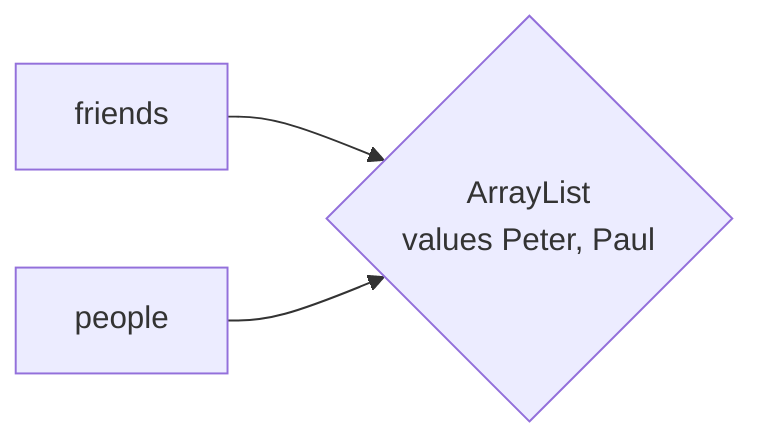
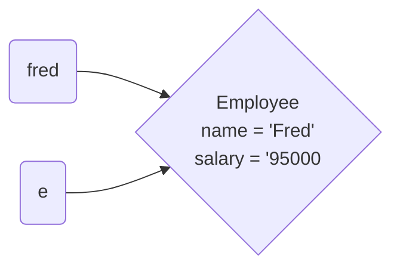
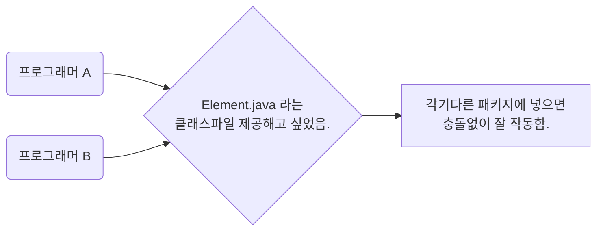

# 2장 객체 지향 프로그래밍

 객체 지향 프로그래밍에서는 객체가 속한 클래스의 동작을 정의하고, 객체를 사용해 작업을 수행. 자바는 모든 메서드를 클래스 안에 선언하며, 기본 타입을 제외한 모든 값이 객체임.

1. 변경자 메서드는 객체 상태를 변경하지만, 접근자 메서드는 객체 상태를 변경하지 않음.

2. <u>자바에서 변수는 객체가 아니라 객체 참조를 저장함.</u>

3. <u>클래스 선언[^1)] 안에 인스턴스 변수와 메서드 구현을</u> 선언함.

4. 인스턴스 메서드는 객체로 호출하며, 호출된 메서드에서는 이 객체를  this참조로 접근할 수 있음.

5. 생성자는 클래스와 이름이 같음. <u>클래스 안에 오버로드된 생성자를 여러 개 포함할 수 있음.</u>

6. <u>정적 변수는 어떤 객체에도 속하지 않음. 정적 메서드는 객체로 호출하지 않음.</u>

7. 클래스는 패키지로 조직화됨. 임포트 선언을 하면 프로그램 안에서 패키지 이름을 쓰지 않아도 됨.

8. 클래스 안에 다른 클래스를 선언할 수 있음(inner class).

9. 내부 클래스는 비정적 중첩 클래스, <u>내부 클래스의 인스턴스는 자신을 생성한 바깥쪽 클래스의 객체를 참조함.</u>

10. <u>javadoc 유틸리티는 소스 파일을 처리해 선언된 내용과 프로그래머가 작성한 주석으로 HTML파일을 만듬.</u>

    [^1)]: C/C++ 처럼 헤더파일과 구현 파일을 분리해서 사용하는 언어는 헤더 파일에 클래스를 선언하고 구현 파일에 클래스를 정의함. 하지만 자바는 헤더 파일과 구현 파일을 분리하지 않으므로 클래스를 선언하면서 내용을 정의함. 자바에서 '클래스 선언', '메서드 선언'등으로 칭하는 용어가 다른 언어에서는 선언과 정의를 동시에 지칭할 수 있다.(물론 '인터페이스 안에 추상 메서드를 선언한다'고 할 때는 그 메서드 헤더만 선언하는 것을 의미함.)

## 2.1 객체 사용

 객체가 발명되기 전에는 **함수**``(function)``를 호출하는 방식으로 프로그램 작성, 함수를 호출하면 함수는 결과를 반환함. 함수를 사용하면 작업을 공유할 수 있다는 장점이 있음. 작업방식은 몰라도 누군가가 작성한 함수를 호출할 수 있음. <- 객체 이전 방식에 대한 설명

 <u>객체는 여기에 한 차원을 더함. 객체마다 자신만의 **상태**`(state)`가 있음. 이 상태는 메서드를 호출해서 얻는 결과에 영향을 줌. ex) `in`이 `Scanner`의 객체일 때 `in.next()`를 호출하면 `in` 객체는 이전에 무엇을 읽었는지 기억하고 다음 입력 토큰을 줌. <- 객체의 방식</u>

 <u>**다른 사람이 구현한 객체의 메서드를 호출할 때는 내부에서 무슨 일이 일어나는지 몰라도 됨**. <- **캡슐화</u>**`(encapsulation)`이라고 함. 이는 객체 지향 프로그래밍의 핵심 개념임. <- 제 개인적 생각은 이로인해 발생하는 문제도 많다고 생각

 다른 개발자가 사용할 수 있는 객체를 제공해 자신의 작업을 공유하고 싶을 때는 같은 동작을 하는 객체를 생성하고 사용하는 메커니즘인 **클래스**`(class)`를 만들어 제공하면 됨.

 달력을 만든다고 생각할 때 자바는 제공해주는 객체를 사용하여 빠르게 만들 수 있음.

표준 자바 라이브러리로 구현한다고 했을 때, 특정 위치로 고정하지 않고 날짜를 표현하는데 `LocalDate`클래스를 사용함. 특정 달의 첫날짜를 나타내는 `LocalDate`클래스의 객체가 있어야함.

`LocalDate date = LocalDate.of(year, month, 1);`

그 다음 날로 날짜를 넘기려면 `date.plusDays(1)`을 호출, 호출 결과는 다음 날로 새로 생성된 `LocalDate`객체임. 여기서는 결과를 `date`변수에 다시 할당함.

`date = date.plusDays(1);`

날짜 객체에 메서드를 호출해 날짜가 속한 달과 같은 정보를 얻어야함. 이 정보가 있어야 같은 달에 속한 날짜들을 출력할 수 있음.

```java
while(date.getMonthValue() == month) {
    System.out.printf("%4d", date.getDayOfMonth());
    date = date.plusDays(1);
    ...
}
```

`getDayOfWeek`메서드는 날짜가 속한 요일을 알려줌

`DayOfWeek weekday = date.getDayOfWeek();`

이렇게 호출 시 또 다른 클래스인 `DayOfWeek`의 객체를 돌려받음. 달력에서 특정 달의 1일을 얼마나 들여 써야 하는지 계산하려면 요일의 숫자 값을 알아야함. 요일의 숫자 값을 알려주는 메서드는 `getValue`임.

```java
int value = weekday.getValue();
for(int i = 1; i < value; i++)
    System.out.print("   ");
```

`getValue`메서드는 주말이 주의 마지막에 오는 국제 관례에 따라 월요일이면 1, 화요일이면 2 등으로 반환 일요일의 숫자 값은 7임.

> Note = 다음과 같이 메서드를 연이어`(chain)`호출할 수 도 있음.
>
> `int value = date.getDayOfWeek().getValue();`
>
> 첫 번째 메서드 호출 `date`객체에 적용, 결과로 `DayOfWeek`객체를 반환, 그 다음으로 반환받은 객체의 `getValue`메서드를 호출

[완성된 프로그램 예제 소스](https://github.com/gilbutITbook/006985/ch02/sec02/Cal.java)

### 2.1.1 접근자 메서드와 변경자 메서드

 <u>호출되는 객체를 변경하는 메서드를 **변경자**`(mutator)`라고 함</u>. <u>객체를 변경하지 않는 메서드를 **접근자**`(accessor)`라고 함.</u> ex) `LocalDate`클래스의 `plusDays` 메서드는 접근자임.

 사실 `LocalDate`클래스의 모든 메서드가 접근자임. <u>객체 변경은 위험할 수 있음</u>*(특히 두 연산이 객체 하나를 동시에 변경할 때)* 갈수록 이런 형태가 보편화됨. <u>요즘 대다수의 컴퓨터는 CPU가 여러개 있으므로 동시 접근 안정성은 중요한 이슈</u>임. -> <u>이 문제의 해결 방법 중 하나는 접근자 메서드만 제공해 불변`(immutable)`객체로 만드는 것.</u>

 그래도 여전히 변경이 필요할 때 많음. 변경자 ex) `ArrayList` 클래스의 `add`메서드가 있음. `add`를 호출하면 배열 리스트 객체가 변경됨.

```java
ArrayList<String> friends = new ArrayList<>();
	// friends 비어있음.
friends.add("Peter");
	// friends 크기 1로 변경
```

- 추가로 보면 좋을만한 자료 : [Limky님 블로그](http://limkydev.tistory.com/68)

### 2.1.2 객체 참조

` C++`같은 <u>일부 프로그래밍 언어에서는 변수에 실제 객체(즉, 객체의 상태를 구성하는 비트들)를 담을 수 있음. 하지만 자바에서는 안그렇다.</u> **<u>변수에는 오직 객체 참조`(reference)`만 담을 수 있다.</u>** 객체는 다른 곳에 있고, 참조는 실제 객체를 찾아내는 구현체 고유의 방법임.


> Note = 참조는 아주 안전하다는 점을 제외하면 `C/C++`의 포인터와 유사하게 작동, `C/C++`에서는 포인터를 수정하고 포인터로 임의의 메모리 위치를 덮어쓸 수 있음. 자바의 참조로는 특정 객체에만 접근 할 수 있음.

**객체 참조를 담은 변수를 다른 변수에 할당하면 같은 객체 참조를 두 개 가짐.**

```java
ArrayList<String> friends = new ArrayList<>();
ArrayList<String> people = friends;
// 이제 people과 friends는 같은 객체를 참조함.
```

공유된 객체를 변경하면 두 참조로 해당 변경 사실을 알아낼 수 있음.

`people.add("Paul");`

<u>`people`의 크기는 2가 되는데, `friends`도 동일함(물론 기술적으로는 `people`이나 `friends`의 크기가 2가 되는 것 아님.</u> -> 얘들은 객체가 아니라 크기가 2인 배열 리스트 객체의 참조임.)



**<u>객체 공유하면 효율적이고 편리하지만, 어떤 참조로도 공유 객체를 변경할 수 있다는 단점이 있음.</u>**

<u>하지만 `String`이나 `LocalDate`처럼 클래스에 변경자 메서드가 없다면 걱정없음. 누구도 객체를 변경할 수 없으므로 해당 객체에 대한 참조를 얼마든지 공유할 수 있음.</u>

객체 변수를 특별한 값인 `null`로 설정해 변수가 어떤 객체도 참조하지 않게 할 수 있음.

```java
LocalDate date = null; //이제 date는 어떤 객체도 참조하지 않음.
```

*위 방법은 `date`가 참조할 객체가 아직 없거나 특별한 상황(알 수 없는 날짜같은)을 나타내고 싶을 때 유용*

> Caution = 널`(null)`을 예상하지 못한 상황에서는 `null`값이 위험을 초래할 수 있음. `null`로 메서드를 호출하면 `NullPointException`이 일어남 -> 실제로는 `NullReferenceException`이 맞는 표현이라고함. -> 이런 이유로 옵션값에 `null` 사용하는것 권장하지 않음. `null` 대신 `Optional` 타입(8장 스트림 참고) 사용.

할당 살펴보자

```java
date = LocalDate.of(year, month, 1);
date = date.plusDays(1);
```

 첫번째 할당 후 `date`는 지정한 연, 월의 1일을 가르킴. **`plusDays` 호출은 새 `LocalDate`객체를 돌려주며, 두 번째 할당 후 `date` 변수는 새 객체를 참조함.** -> 이 때 첫번째 객체는 그것과 관련된 참조가 없으므로 더는 필요 없음. 결국 가비지 컬렉터가 메모리를 정리해 메모리를 재사용할 수 있게 함.

- 추가로 보면 좋을만한 자료 : [Yaboong / 자바의 메모리관리 - Stack과 Heap](https://yaboong.github.io/java/2018/05/26/java-memory-management/)


## 2.2 클래스 구현

 `Employee`클래스를 만들어 다양한 언어 규칙 알아봄. 직원(employee) {이름(name), 급여(salary)} 직원이름은 불변, 수시로 합당한 급여 인상은 있음.

### 2.2.1 인스턴스 변수

 자바에서는 인스턴스 변수`(instance variable)`로 객체의 상태를 나타냄. 인스턴스 변수는 다음과 같이 클래스 안에 선언

```java
public class Employee{
    private String name;
    private double salary;
    ...
}
```

위 선언은 `Employee`클래스의 모든 인스턴스는 `name`과 `salary`변수를 가진다는 의미임.

**<u>인스턴스 변수를 보통 `private`로 선언함. `private`로 선언하면 같은 클래스에 속한 메서드만 변수에 접근할 수 있음</u>**. -> 이런 보호가 바람직한 이유는 두가지, 

1. *프로그램의 어느 부분이 변수를 변경할 수 있는지 제어,* 
2. *언제든지 내부 표현을 변경할 수 있음.* 

ex) 이 직원들을 DB에 저장하고 객체에는 오직 기본키`(primary key)`만 남겨 둘 수도 있음. 메서드를 이전과 똑같이 작동하도록 재구현하는 한 클래스의 사용자는 이런 변경을 개의치 않음.

### 2.2.2 메서드 헤더

 이제 `Employee`클래스의 메서드를 구현해보면, 메서드를 선언할 때는 메서드이름, 매개변수의 타입과 이름, 반환 타입을 지정해야됨.

```java
public void raiseSalary(double byPercent)
```

 `double`타입 매개변수를 한개 받고, (반환 타입이 `void`이므로) 어떤 값도 반환하지 않음.

`getName` 메서드는 시그너처`(signature)`(서명)가 다름.

```
public String getName()
```

이 메서드는 매개변수가 없고 `String`을 반환

> Note = <u>대부분의 메서드는 `public`으로 선언(누구든지 해당 메서드를 호출 가능)</u>한다. 때로는 헬퍼 메서드를 `private`으로 선언(같은 클래스에 속한 다른 메서드에서만 사용하도록 제한)함. <u>클래스 사용자와 관련이 없는 메서드(특히 세부 구현에 의존한다면) `private`으로 선언해야 함</u>. 그러면 구현을 변경할 때 비공개 메서드를 안전하게 변경하거나 제거할 수 있음.

---

### 2.2.3 메서드 바디

메서드 헤더 다음에는 바디를 작성

```java
public void something(){
    //여기가 메서드 바디
}
```

메서드에서 값을 돌려줄 때는 return 키워드를 사용

```java
public String getName() {
    return name;
}
```

메서드 선언은 클래스 선언 안에 넣어야함.

```java
public class Employee {
    private String name;
    private double salary;
    
    public void raiseSalary(double byPercent) {
        double raise = salary * byPercent / 100;
        salary += raise;
    }
    
    public String getName(){
        return name;
    }
    ...
}
```

### 2.2.4 인스턴스 메서드 호출

메서드 호출을 살펴봅시다

```java
fred.raiseSalary(5)
```

인수 5는 `raiseSalary`의 매개변수인 `bypercent`를 초기화하는 데 사용되는데, 다음과 같은 할당에 해당함.

```java
double byPercent = 5;
```

다음 동작

```java
double raise = fred.salary *byPercent / 100;
fred.salary += raise;
```

인스턴스 변수 salary는 메서드 호출에 사용한 인스턴스에 적용된다는 점을 명심.

1장에서 다룬 메서드와 달리 `raiseSalary`메서드는 클래스의 인스턴스에 작동함. <- 인스턴스 메서드`(instance method)`라고 함. <u>자바에서 `static`으로 선언하지 않은 메서드는 모두 인스턴스 메서드임.</u>

코드에서 볼 수 있듯 `raiseSalary` 메서드에는 값이 두개 전달됨(메서드 호출을 받는 객체에 대한 참조와 호출 인수).  기술적으로는 둘다 메서드의 매개변수이나, 자바에서는 다른 객체 지향 언어처럼 첫 번째 값이 특별한 역할을 함. 이 <u>첫번째 값을 메서드 호출의 **수신자**`(receiver)`라고도 함.</u>

### 2.2.5 this 참조

<u>객체의 메서드를 호출할 때 해당 객체가`this`로 설정됨.</u> 원한다면 메서드 구현 시 `this` 참조를 써도됨.

```java
public void raiseSalary(double byPercent){
    double raise = this.salary * byPercent / 100;
    this.salary += raise;
}
```

일부 개발자 지역 변수와 인스턴스 변수를 명확히 구별하려고 이 스타일 선호.

흔히 매개변수 이름을 인스턴스 변수와 다르게 지정하고 싶지 않을 때 `this` 참조를 사용

```java
double salary;
//..
//main..
public void setSalary(double salary) {
    this.salary = salary;
}
```

인스턴스 변수와 지역 변수의 이름이 같을 때 `salary` 처럼 한정하지 않은 이름은 지역 변수를 나타내고, `this.salary`는 인스턴스 변수를 나타냄.

> Note = 일부 프로그래밍 언어에서는 인스턴스 변수를 `_name`이나 `salary`식으로 씀. 쓸수는 있으나 보통은 안씀.

---

?????

> Note = 원한다면 `this`를 메서드의 매개변수로도 선언할 수 있음(생성자의 매개변수로는 선언할 수 없음).
>
> ```java
> public void setSalary(Employee this, double salary) {
>     this.salary = salary;
> }
> ```
>
> 그러나 이 문법은 아주 드물게 사용 -> 메서드의 수신자에 애너테이션을 붙이는 용도로만 사용함. 11장 애너테이션 참고

????

---

### 2.2.6 값을 사용한 호출

<u>메서드에 객체를 전달하면 해당 메서드는 객체 참조의 사본을 얻음.</u> 메서드는 <u>이 참조로 매개변수 객체에 접근하거나 매개변수 객체를 변경할 수 있음.</u>

```java
public class Evilmanager {
    private Random generator;
    ...
    public void giveRandomRaise(Employee e) {
    	double percentage = 100 * generator.nextGaussian();
        e.raiseSalary(percentage);
    }
}
```

`boss.giveRandomRaise(fred);`를 호출한다고 하면, `fred`를 `e`매개변수로 복사함. `giveRandomRaise` 메서드는 두 참조가 공유하는 객체를 변경함.



자바에서는 <u>**기본 타입 매개변수를 업데이트하는 메서드를 작성할 수 없음**</u>. ex) 다음과 같이 `double` 값을 증가시키는 메서드는 의도한 대로 작동하지 않음.

```java
public void increaseRandomly(double x) {//의도한대로 작동하지 않음.
	double amount = x * generator.nextDouble();
    x += amount;
}
```

`boss.increaseRandomly(sales);`

를 호출하면 `sales`가 `x`로 복사됨. 다음으로 `x`를 증가시키지만 `sales`는 변하지 않음. 이후 <u>**매개변수는 유효 범위를 벗어나고 증가 연산은 효력을 잃음.**</u> <-- {} 스코프 안에서 동작한 후 결과는 원래 참조의 변화를 가져다 주지 않음.(기본타입의 매개변수의 경우) -> 객체 ex) ArrayList의 경우는 변화함.

**같은 이유로 객체 참조를 다른 것으로 바꾸는 메서드도 작성할 수 없음.**

다음 메서드 의도대로 작동안함.

```java
public class EvilManager {
    ...
    public void replaceWithZombie(Employee e) {
    	e = new Employee("", 0);
    }
}
```

`boss.replaceWithZombie(fred);`

호출하면 `fred`가 `e`변수로 복사됨. 그런다음 `e`는 다른 참조로 설정됨. 메서드가 끝날 때 **`e`는 유효 범위를 벗어남. 결국 `fred`는 어디서도 변경되지 않았음.**

> Note = 자바는 객체에 '참조를 이용한 호출'을 사용한다고 말하는 사람도 있음. 두번째 예제에서 보듯 이말은 사실이 아님. 참조를 이용한 호출을 지원하는 언어에서는 메서드가 전달받은 변수의 내용으로 다른 것으로 교체할 수 있음. 자바에서는 기본 타입 값은 물론 객체 참조까지 모든 매개변수가 값으로 전달됨.

## 19.01.19

## 2.3 객체 생성

2.3.1 생성자 구현

```java
public Employee(String name, double salary){
    this.name = name;
    this.salary = salary;
}
```

> Note = 비공개`(private)` 생성자도 유용함. `LocalDate`클래스에는 공개 생성자가 없음. 그 대신 클래스의 사용자는 `now`와 `of`같은 '팩토리 메서드'로 객체를 얻음. 이런 팩토리메서드는 비공개 생성자를 호출함.

> Caution = 다음과 같이 실수로 반환타입을 명시했다면
>
> ```java
> public void Employee(String name, double salary)
> ```
>
> 생성자를 선언하는 것이 아니라 `Employee`라는 메서드를 선언하는 것이 됨.

생성자는 `new` 연산자를 사용한 시점에 실행됨.

```java
new Employee("James Bond", 500000)
```

`Employee`클래스의 객체를 할당한 후 생성자 바디를 호출함. 그리고 생성자 바디는 생성자에 전달된 인수로 인스턴스 변수를 초기화함.

`new` 연산자는 생성된 객체의 참조를 반환함. -> 보통은 반환받은 참조를 변수에 저장함.

```java
Employee james = new Employee("James Bond", 500000);
```

또는 메서드에 전달하기도 함.

```java
ArrayList<Employee> staff = new ArrayList<>();
staff.add(new Employee("James Bond", 500000));
```

### 2.3.2 오버로딩

생성자는 두가지 이상의 버전을 제공할 수 있음. ex) 이름이 없는 직원을 쉽게 모델링하려면 급여만 매개변수로 받는 두번째 생성자 작성

```java
public Employee(double salary){
    this.name = "";
    this.salary = salary;
}
```

호출되는 생성자는 인수에 따라 결정됨.

```java
Employee james = new Employee("James Bond", 500000);
//Employee(String, double) 생성자를 호출함.
Employee james = new Employee(40000);
//Employee(double) 생성자를 호출함.
```

<u>이때는 해당 생성자가 **오버로드**`(overload)`**(중복 정의)**되었다고 함.</u>

> Note = 이름은 같지만 매개변수가 다른 메서드가 여러 개 있으면 메서드가 오버로드된 것이다. 예를 들어 각각 `int`, `double`, `String` 등을 매개변수로 받는 `println` 메서드의 오버로드된 버전이 있다. 생성자 이름은 달리 선택할 여지가 없으므로 일반적으로 생성자를 오버로드한다.

### 2.3.3 다른 생성자에서 특정 생성자 호출

비슷한 작업을 수행하는 생성자가 여러 개 있다면 코드 중복을 제거하는 것이 가장 좋음. <u>공통된 초기화 작업은 대체로 생성자 하나에 몰아 넣을 수 있음.</u>

<u>*또 다른 생성자에서 어느 한 생성자를 호출할 수 있는데, 호출하는 쪽 생성자 바디의 첫번째 문장으로만 허용함. 호출할 생성자 이름이 아니라 `this`키워드를 사용함.*</u>

```java
public Employee(double salary){
    this("", salary); // Employee(String, double)을 호출함.
    //이후 다른 문장이 올 수 있다.
   	//java 10 잘작동함.
}
```

> Note = 여기서`this`는 생성될 객체 참조가 아님. `this`는 같은 클래스에 속한 다른 생성자를 호출할 때 사용하는 특수 문법. -> **`this`뿐만 아니라 여러가지 개념(static)들이 위치에 따라 속성이나 동작이 달라진다는 것을 알 수 있음.**

### 2.3.4 기본 초기화

생성자 안에서 인스턴스 변수를 명시적으로 설정하지 않을 시 자동으로 변수를 기본 값으로 설정함.

***숫자는 0, `boolean`은 `false`, 객체 참조는 `null`이 기본 값임.***

무급 인턴용 생성자 작성가능(상위에 나오는 Employee 클래스를 떠올려라)

```java
public Employee(String name){
    //salary는 0으로 자동 설정됨.
    this.name = name;
}
```

> **Note = 인스턴스 변수(전역)는 지역변수와 완전히 다름. 지역 변수는 항상 명시적으로 초기화 해야됨.**

숫자는 보통 0으로 초기화하면 편함. 하지만 *객체 참조를 기본 값`null`로 초기화하는 것은 오류의 원인이 됨.*</u>

```java
public Employee(double salary){
    //name은 자동으로 null로 설정됨.
    this.salary = salary;
}

if(e.getName()).equals("James Bond"))
    //nullPointException 뜬다.
```

### 2.3.5 인스턴스 변수 초기화

```java
public class Employee{
    private String name = "";
    ...
}
```

모든 인스턴스 변수에 상위처럼 초깃값을 지정할 수 있다.

이 초기화는 객체를 할당하고 나서 생성자가 실행되기 전에 일어난다. 따라 모든 생성자의 초기값은 같다. 물론 생성자에서 초기값을 덮어쓸 수도 있음.

*인스턴스 변수를 선언할 때 초기화하는 방법 외에 클래스 선언 안에 임의의 초기화블록`(initialization)`을 넣는 방법도 있음.*

```java
public class Employee(){
    private String name = "";
    private int id;
    private double salary;
    {
        //초기화블록
        Random generator = new Random();
        id = 1 + generator.nextInt(1_000_000);
    }
    public Employee....
}
```

> **Note = 초기화 블록은 자주 사용하는 기능이 아님 -> 대부분은 긴 초기화 코드를 헬퍼 메서드 안에 두고, 생성자에서 헬퍼 메서드를 호출함.**

인스턴스 변수 초기화와 초기화 블록은 클래스 선언에 나타난 순서로 실행하며, 그 다음 생성자를 실행함.

### 2.3.6 최종 인스턴스 변수

***<u>인스턴스 변수를 최종`(final)`로 선언 가능, `final`로 선언한 변수는 생성자 실행이 끝나기 전에 초기화해야 함. 초기화한 후에는 해당 변수를 수정할 수 없음.***</u>

ex) `Employee`클래스의 `name` 변수는 객체를 생성한 후에는 절대 변하지 않으므로`(setName 메서드가 없음)` `final`로 선언할 수 있음.

```java
public class Employee{
    private final String name;
    ...
}
```

>  <u>***Note = 변경 가능한 객체를 가르키는 참조에 사용하면 `final`제어자는 그저 참조 자체가 절대로 변하지 않는다는 사실만 나타냄. 따라 객체의 내용을 변경하는 것 합법`(ArrayList 같은 것들)`***</u>
>
> <u>***이 참조는 다른 객체로는 절대 교체할 수 없음. null로 설정할 수 없음.***</u>

### 2.3.7 인수 없는 생성자

적절한 기본 값으로 상태를 설정한 객체를 생성함. ex) 다음은 Employee클래스의 인수 없는 생성자다.

```java
public Employee(){
    name = "";
    salary = 0;
}
```

<u>클래스에 생성자가 없으면 자동으로 아무작업도 하지 않는 인수 없는 생성자를 받음.</u> 모든 인스턴스 변수는 명시적인 초기화 없이 기본값(0이나 `false`또는 `null`)로 남음. 따라서 모든 클래스에는 생성자가 적어도 하나는 있음.

> <u>Note = 클래스에 생성자가 이미 있으면 인수 없는 생성자를 자동으로 받지 않는다. 생성자가 있는데도 인수 없는 생성자가 필요하다면 직접 작성해야함.</u>

> <u>***Note = 현재까지 객체생성을 알아봄. C++로 대표되는 일부 프로그래밍 언어에서는 일반적으로 객체가 소멸될 때 해야할 작업을 지정함. 자바에는 가비지 컬렉터가 객체를 회수할 때 해당 객체를 '마무리하는' 메커니즘이 있음. 하지만 마무리 과정이 예측할 수 없는 시간에 일어나므로 이 메커니즘을 사용하지 말아야 함. 5장 예외, 단정, 로깅에서 살펴보겠지만, 자바에는 파일 등 리소스를 닫는 메커니즘이 따로 존재함.***</u>

## 2.4 정적 변수와 정적 메서드

지금까진 메인 메서드에 `static`제어자가 붙었음. 이 절에서는 `static`에 대해 알아봄.

### 2.4.1 정적 변수

클래스 안에 변수를 `static`으로 선언하면 해당 변수는 클래스당 하나만 존재함. 반면 각 객체에는 자체적인 인스턴스 사본이 들어 있음. -> ex) 각 직원에게 유일한 `ID번호`를 부여한다고 하면 마지막으로 부여한`ID`를 공유해야함.

```java
public class Employee{
    private static int lastId = 0;
    private int id;
    ..
    public Employee(){
        lastId++;
        id = lastId;
    }
}
```

<u>***모든 `Employee`객체는 인스턴스 변수인`id`를 각자 보유함. 하지만 `lastId`변수는 오직 하나임. `lastId`변수는 클래스의 특정 인스턴스가 아니라 클래스 자체에 속함.***</u>

`new Employee`객체를 생성하면 공유된 `lastId`변수가 증가하고, 인스턴스 변수 `id`가 증가한 값을로 설정됨. 따라서 모든 직원 객체가 유일한 `id`값을 얻음.

> *Caution = 여러 스레드가 `Employee`객체를 동시에 생성하면 이 코드는 제대로 작동하지 않음. 10장 병행 프로그래밍에서 이 문제를 해결하는 방법을 자세히 설명함.*

> Note = 왜 개별 인스턴스가 아니라 클래스에 속하는 변수를 '정적`(static)`'이라고 하는지 궁금할 것. 이 용어는 C++에서 유래한 의미없는 유물임. 의미를 더 적절하게 드러내는 용어는 '클래스 변수'라고 할수 있음.

### 2.4.2 정적 상수

변경 가능한 정적 변수는 드물지만, 정적 상수(`static final`변수)는 아주 일반적임.

ex) `Math`클래스는 다음 정적 상수를 선언함. 프로그램에서는 이 상수를 `Math.PI`로 접근함.

```java
public class Math{
    ...
    public static final double PI = 3.14159265....;
    ...
}
```

`static`키워드가 없으면 `PI`는 `Math`클래스의 인스턴스 변수가 됨. `PI`에 접근하려면 `Math`클래스의 객체가 필요하며, 모든 `Math`객체는 자체적으로 `PI`의 사본을 가지고 있어야 함.

다음은 숫자가 아니라 객체를 담는 정적 `final`변수의 예. 난수가 필요할 때마다 새 난수 발생기를 생성하는 방법은 쓸모가 없고 안전하지도 못함. 이보다는 클래스의 모든 인스턴스에서 난수 발생기를 하나 공유하는 방법이 좋음.

```java
public class Employee {
    private static final Random generator = new Random();
    private int id;
    ...
        public Employee() {
        id = 1 + generator.nextInt(1_000_000);
    }
}
```

정적 상수의 또 다른 예는 `System.out`임. `System.out`은 `System`클래스에 다음과 같이 선언되 있음.

```java
public class System{
    public static final PrintStream out;
    ...
}
```

> Caution = `out`이 `System`클래스 안에 `final`로 선언되어 있는데도 `System.out`을 다른 스트림으로 설정하는 `setOut`메서드가 있음. `setOut`은 자바로 구현하지 않는 '네이티브'메서드[^1]로 자바 언어의 접근 제어 메커니즘을 우회할 수 있음. -> 자바 초창기부터 이어온 아주 특이한 상황으로 다른곳에서는 거의 접하지 않음.
>
> [^1]: JNI(Java Native Interface)를 사용해서 만든 메서드임. JNI는 자바 가상 머신을 구동하는 '네이티브'운영체제(윈도, 리눅스, macOS 등)에서 제공하는 API에 접근하는 메커니즘임. ....(생략)..... JNI를 사용하면 자바의 이식성이 떨어질 수 있고, 잘못 작성하면 오히려 순수 자바로 작성한 프로그램보다 느릴 수 있으므로 필요할 때만 활용하는 것이 좋음. [자세한 내용](http://en.wikipedia.org/wiki/Java_Native_Interface)를 참고.

### 2.4.3 정적 초기화 블록

앞에서는 정적 변수를 선언하면서 초기화함. 그러나 초기화작업이 추가로 필요할 때 있음. 이런 작업을 정적 초기화 블록`(static initialization block)`안에 넣으면 됨.

```java
public class CreditCardForm{
    private static final ArrayList<Integer> expirationYear = new ArrayList<>();
    static {
        //다음 20개 year을 배열 리스트에 추가
        int year = LocalDate.now().getYear();
        for(int i = year; i <= year + 20; i++){
            expirationYear.add(i);
        }
    }
    ...
}
```

정적 초기화는 클래스를 처음 로드할 때 일어남. 인스턴스 변수와 마찬가지로 정적 변수를 명시적으로 다른 값으로 설정하지 않으면 0, `false`, `null`이 됨. 모든 정적 변수 초기화와 정적 초기화 블록은 클래스 선언 안에 나타난 순서로 실행됨.

### 2.4.4 정적 메서드

//참조 - `static`관련하여 `method`역시 정적으로 선언할 시 메모리에 올라가는 것인지에 대한 궁금증이 있어 찾아보았음. 참조 사이트에 간략한 설명을 한번쯤은 보고 메모리를 이해하고 넘어가기를 권장합니다. [참조보기](http://blog.naver.com/PostView.nhn?blogId=heartflow89&logNo=220954420688)

정적 메서드는 객체에 작동하지 않는 메서드임. ex) `Math`클래스의 `pow`메서드는 정적 메서드임. 다음 표현식은 x의 a승을 계산함. `Math.pow(x, a)`

이 메서드는 작업을 수행할 때 Math 객체를 전혀 사용하지 않음. 1장 기본 프로그래밍 구조에서 본것처럼 정적 메서드는 static 제어자로 선언함.

```java
public class Math{
    public static double pow(double base, double exponent){
        ...
    }
}
```

`pow`를 인스턴스 메서드로 만들지 않는 이유는 자바에서 기본 타입은 클래스가 아니므로 `double`의 인스턴스 메서드가 될 수 없음. `Math`클래스의 인스턴스 메서드로 만들 수 있었겠지만, 그랬다면 `pow`메서드를 호출하려고 `Math`객체를 생성해야 했을것.

<u>*정적 메서드를 사용하는 또 다른 이유는 다른 사람이 만든 클래스에 부가 기능을 제공하는 것.*</u> ex) 주어진 범위에 속한 임의의 정수를 돌려주는 메서드가 있다면?? 필자는 멋있다고 하고있음... ... 표준 라이브러리에 있는 `Random`클래스에 메서드를 추가할 수는 없음. 하지만 다음과 같이 정적 메서드는 만들 수 있음.

```java
public class RandomNumbers{
    public static int nextInt(Random generator, int low, int high){
        return low + generator.nextInt(high-low+1);
    }
}

//커스텀을 한거 같음 멋있노
//이건 호출을
int dieToss = RandomNumbers.nextInt(gen, 1, 6);
```

> Note = 객체로도 정적메서드를 호출할 수 있음. ex) `LocalDate.now()`를 호출해 오늘 날짜를 얻는 대신 `LocalDate`클래스의 `date`객체로 `date.now()`처럼 호출할 수 있음. -> 하지만 의미있는 방법은 아니라고함. `now`메서드는 결과를 계산할 때 `date`객체를 사용하지 않음. 대다수 자바 프로그래머는 이 방법이 볼품없다고 생각함 -> 그러니까 이런방식으로 쓰지말라는 필자의 충고같습니다. 

**정적 메서드는 객체에 작동하지 않으므로 인스턴스 변수에 접근할 수 없음**. **그 대신 자신이 속한 클래스의정적 변수에 접근할 수 있음**. ex) `RandomNumbers.nextInt`메서드는 정적 변수로 만든 난수 발생기`(generator)`에 접근할 수 있음.

```java
public class RandomNumbers{
    private static Random generator = new Random();
    public static int nextInt(int low, int high){
        return low + generator.nextInt(high - low + 1);
        	//정적 변수 generator에 접근가능.
    }
}
```

### 2.4.5 팩토리 메서드

정적 메서드는 흔히 팩토리 머서드를 만드는데 사용함. **팩토리 메서드**`(factory method)` 는 <u>*클래스의 새 인스턴스를 반환하는 정적 메서드를 의미함.*</u> 

ex) `NumberFormat`클래스에는 다양한 스타일에 대응해 포매터 객체를 돌려주는 팩토리 메서드가 있음.

```java
NumberFormat currencyFormatter = NumberFormat.getCurrencyInstance();
NumberFormat percentFormatter = NumberFormat.getPercentInstance();
double x = 0.1;
Syso ...(currencyFormatter.format(x)); // $0.10출력
Syso ...(percentFormatter.format(x)); //10% 출력
```

***<u>생성자 대신 팩토리 메서드를 사용한 이유는 매개변수를 다르게 만드는 것이 생성자를 만드는 유일한 방법이기 때문. 매개변수가 없는 생성자를 두개씩 둘수 없음.</u>***

---

- 신박한 설명인거 같아 남깁니다.(김탱 생각)

  ```java
  //늘 생성자에 같은 인자를 놓게 될 시에 대한 고민을하였음.
  public Class Example{
      private int uid;
      private String name;
      private String addr;
      public Example(int uid, String name){
          //..
      }
      /*public Example(int uid, String addr){
          //.. 허용되지 않음 -> 매개변수가 똑같음. 늘 궁금했음 다른방법은 없나?
      }*/
      public Example(int uid, String name, String addr){
          //.. addr만 필요할 시 name을 null로 지정하고 생성하는 방법사용
          //그러나 본 설명에 의하면 다른 방법이 있다고하고 있음.
          //본 방법에 대해서는 책에서는 4장이라고하니 곧 나올거라 기대함.
      }
  }
  ```

---

더구나 `new NumberFormat(...)`생성자는 `NumberFormat`을 돌려줌(아마 `NumberFormat`이라는 객체의 동작에 대한 설명인듯.), 하지만 팩토리 메서드는 서브클래스의 객체를 반환할 수 있다. -> 실제 이팩토리 메서드들은 `DecimalFormat`클래스의 인스턴스를 반환함(자세한 설명은 4장에서).

팩토리 메서드를 사용하면 불필요하게 새 객체를 생성하는 대신 공유 객체를 반환할 수 있음. ex) `Collections.emptyList()`를 호출하면 변경할 수 없는 빈 리스트(공유 객체)를 반환.

## 2.5 패키지

자바에서 연관된 클래스들은 한 패키지 안에 넣음.

작업을 조직화, 다른 사람이 제공한 코드 라이브러리와 분리하기 편함.

클래스 이름의 유일성을 보장하기 위함.



### 2.5.1 패키지 선언

***패키지 이름은 `java.util.regex`와 같이 점`(.)`으로 구분된 식별자 목록***

***패키지 이름이 유일함을 보장하려면 유일하다고 알려진 인터넷 도메인 이름을 뒤접어 사용하는것이 좋음.***

***ex) `kimtank.blogspot.com`(도메인) -> `com.blogspot.kimtank`(패키지)***

위 규칙을 어긋나는 대표적인 예는 `java`또는 `javax`로 시작하는 표준 자바 라이브러리

> Note = 자바에서 패키지 중첩안됨. ex) `java.util`과 `java.util.regex`패키지는 서로 관련 없음. 각각에는 독립된 클래스 묶음이 들어 있음.

클래스 패키지 안에 넣으려면 클래스 소스 파일의 첫 번째 문장으로 `package`문을 추가해야됨

...예제 생략

간단한 프로그램에 사용하는 이름 없는 기본패키지(default package)개념도 있음. 클래스를 기본 패키지에 추가하려면 `pakage`문을 작성하지 않으면 됨. <-- 권장하지 않음.

> Caution = 소스 파일이 패키지 이름과 일치하는 서브디렉터리에 위치하지 않더라도 `javac` 컴파일러는 잘돌아감. 그러나 클래스 파일은 프로그래머가 직접 올바른 위치로 옮겨 주어야 함. -> 상당히 헷갈리는 작업이라고 합니다.

> Tip = `javac`를 실행할 때 `-d` 옵션을 지정하면 좋음. -> 소스 트리를 어지럽히지 않고 별도의 디렉터리 안에 클래스 파일을 만듬. -> *이렇게 만든 클래스 파일은 올바른 서브 디렉터리 구조를 갖춤. -> 콘솔에서 javac명령어를 상용한 컴파일시를 말하는듯합니다. 일반적으로는 이클립스나 인텔리J와같은 IDE로 컴파일 후 실행하기 때문에 저는 사실 잘 이용해본적이 없어 추가로 필요하다면 콘솔에서의 실행에대한 공부가 필요할거 같습니다.*

### 2.5.2 `jar`명령

클래스 파일을 파일 시스템에 저장하는 대신 `JAR`파일이라는 아카이브 파일 한 개 이상에 넣을 수 있음. `JDK`에 들어 있는 `jar`유틸리티로 이런 아카이브를 만들 수 있음. `jar`의 명령줄 옵션은 유닉스 `tar`프로그램과 비슷하다고함.

`jar --create --verbose --file library.jar com/mycompany/*.class`

짧은 옵션

`jar -c -v -f library.jar com/mycompany/*.class'`

`tar`형식 옵션 사용가능

`jar cvf library.jar com/mycompany/*.class`

`JAR`파일은 보통 라이브러리를 묶는 데 사용함.

> Tip = 라이브러리뿐 아니라 프로그램을 묶는 데도 `JAR`파일 사용가능
>
> `jar -c -f program.jar -e com.mycompany.MainClass com/mycompany/*.class`
>
> `JAR`파일을 만들면 다음과 같이 프로그램을 실행함.
>
> `java -jar program.jar`

> Caution = `JDK`에 들어있는 명령들의 옵션은 전통적으로 `java -jar`처럼 단일 대시 뒤에 다중 문자 옵션이름을 사용했음. 하지만 `jar`명령은 예외였음. `jar`명령은 `tar`명령의 고전적인 옵션 형식을 따라 대시를 사용하지 않았음. 자바 9(현재 10)에서는 `--create`처럼 다중 문자 옵션 이름 앞에는 이중 대시를 붙이고, 흔히 사용하는 옵션에는 `-c`처럼 단일 문자로 된 단축 옵션을 제공하는 좀 더 일반적 옵션 형식으로 옮겨감.
>
> 매우 혼란을 가져옴 `-`과 `--`, 아직 완전히 구현된 것이 아님 -> jar에 관련된 설명이라고 볼순없는 듯 더 거시적인 설명이라 생각함. 그리고 구(9)버전에 대한 설명이기 때문에 명령문에 관련된 것은 따로 필요할 때 보는 것을 염두로 두어야할 것임.

### 2.5.3 클래스 패스

프로젝트에서 라이브러리 `JAR`파일을 사용할 때는 클래스 패스`(class path)`를 지정해 `JAR`파일의 위치를 컴파일러와 가상 머신에 알려야 함. 클래스 패스는 다음 요소를 포함할 수 있음.

- (패키지 이름과 일치하는 서브디렉터리 안) 클래스 파일을 담은 디렉터리
- `JAR`파일
- `JAR`파일을 담은 디렉터리

`javac`와 `java`프로그램에는 `-cp`옵션(긴 버전은 `--class-path`이며, 하위 호환성을 고려해 남겨둔 `-classpath`도 사용할 수 있음) ex) 클래스 패스를 지정하는 예

`java -cp .:../libs/lib1.jar:../libs/lib2.jar com.mycompany.MainClass`

위 클래스 패스에는 현재 디렉터리`(.)`와 `../libs`디렉터리에 들어있는 `JAR`파일 두 개, 즉 요소 세개가 포함되어 있다.

> Note = 윈도에서는 경로를 구분할 때 콜론 대신 세미콜론을 사용
>
> `java -cp .;p..\libs\lib1.jar;..\libs\lib2.jar com.mycompany.MainClass`

> Note = 유닉스에서 셸 확장을 방지하려면 `*`를 이스케이브`(\*)`해야 함.

`JAR`파일이 많을 때는 모두 한 디렉터리에 넣고, 이들 모두가 포함되도록 와일드카드`(*)`를 사용함.

> Caution = `javac` 컴파일러는 항상 현재 디렉터리에서 파일을 찾지만, `java`프로그램은 `'.'`디렉터리가 클래스 패스에 있을 때만 현재 디렉터리를 찾음. 물론 클래스 패스를 설정하지 않앗다면 문제가 되지 않음(기본 클래스 패스는`'.'`디렉터리로 구성됨). 하지만 클래스 패스를 서렂ㅇ했는데 `'.'`디렉터리를 깜빡 잊고 포함하지 않앗다면 오류 없이 컴파일은 되지만 실행이 안됨.

> Caution = 클래스 패스에 와일드카드 옵션을 사용하면 편리하지만 `JAR`파일이 잘 구조화되어 잇을 때만 안정적으로 작동함. 좋은 방법은 아니지만 같은 클래스의 두 가지 버전을 서로 다른 `JAR`파일에 포함할 수 있음. 이런 상황에서는 가장 먼저 발견된 클래스를 선택함. 와일드카드 문법은 `JAR`파일이 처리되는 순서를 보장하지 않으므로, `JAR`파일을 특정 순서로 로드해야 할 때는 사용하지 말아야 함.(15장 플랫폼 모듈은 `JAR`파일 지옥을 방지하기위해 만들었다고함.)

클래스 패스는 보통 `-cp`옵션으로 설정함. 또 다른 방법은 `CLASSPATH`환경 변수를 사용하는 것임. 환경 변수를 설정하는 방법은 사용하는 셸에 따라 다름. 예를 들어 배시`(bash)`에서 다음 명령으로 설정함.

`$ export CLASSPATH=.:/home/username/project/libs/\*$`

윈도우에서

`> SET CLASSPATH=.;C:\User\username\project\libs\*`

> Caution = `CLASSPATH`환경 변수를 전역으로 설정할 수 있다(`.bashrc`파일이나 윈도 제어판의 시스템>고급시스템 설정> 환경변수). 하지만 이 방법을 사용한 많은 프로그래머가 전역 설정을 잊은 채 자신의 클래스를 찾지 못해 놀라면서 후회한다고 한다.

> Note = 15장에서 볼수 있겠지만, 패키지를 모듈로 묶을 수 있음 모듈`(module)`은 강력한 캡슐화를 제공해 프로그래머가 볼 수 있게 허용한 패키지를 제외하고 모든 패키지를 숨김. 15장에서 모듈 패스`(module path)`로 프로그램에서 사용하는 모듈의 위치를 지정하는 방법을 알아본다고 한다.

### 2.5.4 패키지 접근

`public`이 붙은 기능은 모든 클래스에서 사용할 수 있음.

하지만 비공개 기능은 선언한 클래스 안에서만 사용할 수 있음`(private)`

`pubic`이나 `private`을 지정하지 않으면, 해당 기능(즉 클래스, 메서드, 변수)을 같은 패키지에 속한 모든 메서드에서 접근할 수 있음.

패키지 접근은 패키지 내부 메서드에서는 필요하지만 해당 패키지의 사용자에게는 필요 없는 유틸리티 클래스와 메서드에 유용함. ex)테스트 클래스를 같은 패키지에 두면 테스트 클래스에서 테스트 대상 클래스 내부에 접근할 수 있음.

> Note = 소스 파일 하나에 여러 클래스를 포함할 수 있지만, 기껏해야 한 개만 `public`으로 선언할 수 있음. 소스파일에 공개 클래스가 있을 때는 파일 이름이 공개 클래스 이름과 일치해야됨.

패키지 접근이 기본 값이라는 점은 변수에게 불리하게 작용함. 그 ex)

```java
//java.awt 패키지의 Window 클래스에서 발췌한 코드
public class Window extends Container {
    String warningString;
    ...
}
```

`waringString`변수는 비공개가 아니므로 `java.awt`패키지에 속한 모든 클래스에서 이 변수에 접근할 수 있음. 그런데 실제로는 `Window`클래스의 메서드 외에는 무엇도 이 변수에 접근하지 않으니 개발자가 `private`를 깜빡 잊은 것으로 별 수 있음.

패키지가 개바오디어 있으므로 이런 코드는 보안문제를 일으킬 수 있음. 어느 클래스든 적절한 `package`문만 넣어 주면 해당 패키지를 추가할 수 있기때문.

-> 해결책은 패키지를 모듈에 넣는 것. 패키지가 모듈 안에 있으면 클래스를 해당 패키지에 추가할 수 없음. 자바의 라이브러리의 모든 패키지는 모듈로 그룹화되어 있으므로 클래스를 단순히 `java.awt`패키지에 넣는 방법으로는 `Window.warningString`변수에 접근할 수 없음.

### 2.5.5 클래스 임포트

`import`문을 사용하면 전체 이름을 쓰지 않아도 클래스를 이용할 수 있음.

`import java.util.Random;` -> 코드에서 `java.util.Random`을 `Random`으로 사용할 수 있음.

> Note = 임포트 선언은 필수가 아니라 편의로 사용한느 것임. 다시말해 모든 임포트 선언을 빼고 모든 곳에서 전체 클래스 이름을 사용해도 된다.
>
> `java.util.Random generator = new java.util.Random();`

`import`문은 소스파일에서 첫 번째 클래스 선언보다는 위에, `package`문보다는 아래에 두어야 함. 와일드카드를 사용하면 패키지에 들어 있는 모든 클래스를 임포트할 수 있다.

`import java.util.*;`

와일드카드는 오직 클래스만 임포트할 수 있고, 패키지는 임포트 할 수 없음. ex) `import java.*` 안됨.

여러 패키지를 임포트 할 때는 이름 충돌이 날 수 있음. ex) `java.util`과 `java.sql`패키지에는 `Date`클래스가 있음. 다음과 같이 두 패키지를 모두 임포트하는 상황을 가정함.

```java
import java.util.*;
import java.sql.*;
```

프로그램에서 `Date`클래스를 사용하지 않으면 문제 없음. 하지만 패키지 이름 붙이지 않고 `Date`를 참조하면 컴파일러가 오류 보고함. -> 이때 특정 클래스를 지정해 임포트하면 됨.

``` java
import java.util.*;
import java.sql.*;
import java.sql.Date;
```

하지만 실제로 두 클래스가 모두 필요하면 적어도 그중 하나에는 전체이름 사용해야됨.

> Note = `import`문은 개발자에게 편리한 기능, 클래스 파일 내부에서는 모든 클래스를 전체 이름으로 참조함.

> Note = `import`문은 `C/C++`의 `#include` 지시문과 상당히 다름. `#include`는 컴파일용 헤더 파일을 소스에 포함함. 임포트는 파일을 다시 컴파일하게 하지 않음. `C++`의 `using`문처럼 그저 이름을 줄여줄 뿐.

### 2.5.6 정적 임포트

`import static java.lang.Math.*;`

위 지시문을 추가하면 클래스 이름을 접두어로 붙이지 않고도 `Math`클래스의 정적메서드와 정적 변수를 사용할 수 있음.

```java
r = sqrt(pow(x, 2)+pow(y,2)) //Math를 붙이지 않아도 사용할 수 있음.
```

원하는 정적 메서드나 정적 변수만 임포트 가능

```java
import static java.lang.Math.sqrt;
import static java.lang.Math.PI;
```

> Note = 3장과 8장에서 보겠지만 다수의 정적 메서드를 제공하는 `java.util.Comparator`와 `java.util.stream.Collectors`를 사용할 때는 보통 정적 임포트 선언 사용한다고 한다.

## 2.6 중첩 클래스

앞 절 클래스를 패키지 구조화하는 방법 알아봄. 이 방법 외 클래스를 다른 클래스 내부에 두는 방법도 있음. 이런 클래스를 중첩 클래스`(nested class)`. 중첩 클래스는 가시성을 제한하거나 `Element`, `Node`, `Item`처럼 일반적인 이름을 쓰면서도 정돈된 상태를 유지할 때 유용 -> 보기 좋다.

### 2.6.1 정적 중첩 클래스

물품`(item)`의 비용을 청구하는 `Invoice`클래스가 있다고 하자. 각 물품은 설명, 수량, 단가가 포함되 있음.

```java
public class Invoice {
    private static class Item {
        //Invoice 내부에 Item을 중첩함.
        String description;
        int quantity;
        double unitPrice;
        
        double price() {
            return quantity * unitPrice;
        }
    }
    
    private ArrayList<Item> = new ArrayList<>();
    ...
}
```

현재로서는 내부 클래스 `static`으로 선언한 이유는 알수 없음.

접근 제어를 제외하면 `Item`클래스에는 특별한 것 없음. 이 클래스는 `Invoice`안 비공개로 선언해 오직 `Invoice`의 메서드에서만 접근할 수 있음. 그래서 여기서는 이 내부 클래스의 인스턴스 변수를 굳이 비공개로 만들지 않았음.

내부 클래스 객체를 생성하는 메서드

```java
public class Invoice {
	//...
    public void addItem(String description, int quantity, double unitPrice){
      	Item newItme = new Item();
        newItem.description = description;
        newItem.quantity = quantity;
        newItem.unitPrice = unitPrice;
        items.add(newItem);
    }
}
```

클래스는 중첩 클래스를 공개로도 만들 수 있음. 공개로 만들 때는 일반적인 캡슐화 메커니즘을 사용함.

```java
public class Invoice{
    public static class Item {
        //공개 중첩 클래스
        private String description;
        private int quantity;
        private double unitPrice;
        
        public Item(String description, int quantity, double unitPrice) {
            this. description = description;
            this.quantity = quantity;
            this.unitPrice = unitPrice;
        }
        
        public double price(){
            return quantity * unitPrice;
        }
        //...
    }
    private ArrayList<Item> items = new ArrayList<>();
    
    public void add(Item item) {
        items.add(item);
    }
    //...
}
```

위에 코드를 잘 읽어보면 `Invoice.Item`이 `Invoice`내 한정된 것을 알 수 있음.

```java
Invoice.Item newItem = new Invoice.Item("Blackwell Toaster", 2, 19.95);
myInvoice.add(newItem);
```

`Invoice.Item`클래스와 다른 클래스 외부에 선언한 `InvoiceItem`클래스는 근본적 차이가 없음. 클래스 중첩은 그저 `Item`클래스가 청구서에 들어 있는 물품을 표현한다는 사실을 분명하게함. -> 소속? 한정?되어있다 `Item`이 `Invoice`의 아이템인것을 알 수 있음.

### 2.6.2 내부 클래스

`static`으로 선언한 중첩클래스에서 `static`제어자를 빼면 내부클래스`(inner class)`라고 함.

 -> 책의 코드를 다 안적고 싶지만 보고 이해하는게 편하여..

```java
public class Network {
    public class Member {
        //Member는 Network의 내부 클래스
        private String name;
        private ArrayList<Member> friends;
        public Member(String name) {
            this.name = name;
            friends = new ArrayList<>();
        }
        //..
    }
    
    private ArrayList<Member> members = new ArrayList<>();
    //...
}
```

`static`제어자를 빼면 근본적 차이가 생김. ex)`Member`객체는 자신이 어느 네트워크에 속하는지 알게됨. 

```java
public class Network{
    //...
    public Member enroll(Stirng name) {
        Member newMember = new Member(name);
   		members.add(newMember);
    	return newMember;
    }
}
```

-> 아직까지 별일없음

회원을 추가하고 참조 얻자

```java
Network myFace = new Network();
Network.Member fred = myFace.enroll("Fred");
```

`Fred`는 멤버쉽을 해지하려고함.

`fred.deactivate();`

```java
public class Network{
    public class Member {
        //...
        public void deactivate(){
            members.remove(this);
            //deactivate는 members(ArrayList)에서 this를 remove함 -> 전체코드필요
        }
    }
    
    private ArrayList<Member> members;
    //...
}
```

위에서 볼 수 있듯, 내부 클래스의 메서드는 외부 클래스`outer class`의 인스턴스 변수에 접근할 수 있음.

위 코드에서는 내부 클래스를 생성한 외부 클래스 객체(인기 없는 `myFace`네크워크)의 인스턴스 변수`members`다. -> 전체코드 필요

내부 클래스를 정척 중첩 클래스와 구별시키는 요인이라고 볼 수 있음. 내부 클래스의 각 객체는 외부 클래스의 객체에 대한 참조를 포함함.

`members.remove(this);`

-> 실제 의미 `outer.members.remove(this);`

외부 클래스의 숨은 참조를 `outer`로 나타냈음.

정적 중첩 클래스에는 이런 참조가 없음(정적 메서드에 `this`참조가 없는 것과 동일). 중첩 클래스의 인스턴스가 자신을 감싸고 있는 클래스의 어느 인스턴스에 속하는지 알 필요가 없을 때 정적 중첩 클래스를 사용하면됨. 내부 클래스는 이 정보가 중요할 때만 사용하자라고함.

또 내부 클래스는 외부 클래스의 인스턴스를 거쳐 위부 클래스의 메서드를 호출할 수 있음. ex) 외부 클래스에 회원을 탈퇴`(unenroll)`시키는 메서드가 있다고 하면 `deactivate`메서드는 다음과 같이 탈퇴 메서드를 호출할 수 있음.

```java
public class Network{
    public class Member{
        //...
        public void deactivate(){
            unenroll(this);
        }
    }
    
    private ArrayList<Member> members;
    
    public Member enroll(String name){
        //...
    }
    public void unenroll(Member m) {
        //...
    }
    //...
}
```

`deactivate` 메서드에 있는 다음 호출 `unenroll(this);`

-> `outer.unenroll(this)`의미함.

### 2.6.3 내부 클래스용 특수 문법 규칙

내부 클래스 객체의 외부 클래스 참조를 `outer`로 지칭해 설명하였음. 외부 클래스 참조를 나타내는 실제 문법은 조금 더 복잡함.

`OuterClass.this`

ex) 내부 클래스 `Member`의 `deactivate`메서드는 다음과 같이 작성할 수 잇음.

```java
public void deactivate(){
    Network.this.members.remove(this);
}
```

여기서 `Network.this`문법은 필수가 아님. 그냥 `members`로만 참조해도 암묵적으로 외부 클래스 참조를 사용함. 하지만 외부 클래스 참조가 명시적으로 필요할때 있음. 다음은 `Member`객체가 특정 네트워크에 속하는지 검사하는 메서드임.

```java
public class Network{
    public class Member{
        //...
        public boolean belongsTo(Network n){
            return Network.this == n;
        }
    }
}
```

내부 클래스 객체를 생성할 때 해당 객체는 자신을 생성한 외부 클래스 객체를 기억한다. 앞에서는 다음 방법으로 새 회원을 생성함.

```java
public class Network{
    //...
    Member enroll(String name){
        Member newMember = new Member(name);
        //...
    }
}
```

위 코드는 `Member newMember = this.new Member(name);`의 축약형임.

외부 클래스의 어느 인스턴스로도 내부 클래스 생성자를 호출할 수 있음.

`Network.Member wilma = myFace.new Member("Wilma");`

> Note = 내부 클래스에는 컴파일 시간 상수 외에 정적 멤버를 선언할 수 없음. '정적'이라는 의미가 모호할 수도 있음. 이 용어는 가상 머신 안에 인스턴스가 하나만 있음을 의미하는 것일까? 아니면 외부 클래스 객체마다 인스턴스가 하나만 있음을 의미할까? 언어 설계자는 이문제를 짚고 넘어가지 않기로 했다고 한다.

> Note = 가상 머신의 명세를 완성한 것으로 보던 시기에 역사적인 실수를 해서 자바 언어에 내부 클래스가 추가되었음. 그래서 내부 클래스는 자신을 감싸고 있는 인스턴스를 참조하는 숨은 인스턴스 변수를 멤버로 가진 일반 클래스로 변환됨.

> Note = 지역 클래스`(local class)`는 내부 클래스의 또 다른 변형임. 3장에서 자세설명

## 2.7 문서화 주석

`JDK`에는 `javaodc`이라는 도구있음. `javadoc` 소스파일로 `HTML`문서를 만듬.

소스 코드에서 /*\*로 시작하는 주석 추가시 온라인 `API` 문서처럼 만들 수 있음.

코드와 주석을 한꺼번에 볼 수 있는 좋은 방법이니 잘 알아서 잘 쓴다면, 따로 문서화를 세부적으로 할 필요가 없다고함.

### 2.7.1 주석 넣기

`javadoc`유틸리티는 다음과 같은 정보 추출

- 공개 클래스와 인터페이스
- 공개, 보호 생성자와 메서드
- 공개, 보호 변수
- 패키지와 모듈

인터페이스와 보호기능은 다른 장에서 상세히 설명하겠다고함.

각각 주석을 달 수 있고, 그렇게 해야함. 주석은 설명할 기능 바로 위에 붙임. /*\*로 시작 \*/로 끝남.

문서화 주석에는 자유 형식 텍스트와 태그를 적는데 태그는 `@author`나 `@param`처럼 `@`로 시작.

1. 자유형식 텍스트의 첫 번째 문장은 요약문이어야 함. -> `javadoc`유틸리티는 이 요약문을 추출해서 자동으로 요약 페이지를 만듬.
2. 자유 형식 텍스트에는 강조를 나타내는 `HTML`태그를 사용할 수 있음. 심지어 ``까지. 하지만 제목태그`<hn>`이나 수평 구분선 태그`<hr>`은 문서 형식과 충돌할 수 있으니 사용하지 말아야함.

> Note = 주석에 이미지 링크가 들어갈 때가 있음. ex) 다이어그램이나 UI(사용자 인터페이스) 컴포넌트 이미지의 링크 넣는경우. 이때 소스 파일 디렉터리에 `doc-files`라는 서브디렉터리를 만들어 여기에 이미지 넣으면됨. -> 동작은 `javadoc`유틸리티가 `doc-files`디렉터리와 그 안에 있는 파일을 소스 디렉터리에서 문서 디렉터리로 복사함. 링크에는 ``처럼 `doc-files`디렉터리를 지정해야함. <- 안써봐서 모르겠지만, 사용한다면 typora만큼 편리할 것으로 보입니다.

### 2.7.2 클래스 주석

클래스 주석은 반드시 클래스 선언 바로 앞에 붙여야됨. `@author`와 `@version`태그로 저자와 버전을 문서화 가능함.

```java
/**
 * <code>Invoice</code> 객체는 각 주문 항목에 해당하는 품목을 나열한 청구서를 표현함.
 * @author 프레드
 * @author 바니
 * @version 1.1
 */
public class Invoice{
    //...
}
```

### 2.7.3 메서드 주석

메서드 주석은 메서드 바로 앞에 붙임. 다음 기능을 문서화 함.

- 각 매개변수 `@param variable description`
- void가 아닌 반환 값 `@retrun description`
- 메서드에서 던지는 예외 `@throws ExceptionClass description`

```java
/**
 * 직원의 급여를 인상함.
 * @param byPercent 급여 인상 백분율(예를 들어 10은 10% 의미)
 * @retrun 인상액
 */
public double raiseSalary(double byPercent){
    //...
    return raise;
}
```

### 2.7.4 변수 주석

공개 변수(일반적으로 정적 상수)만 문서화하면됨.

```java
/**
 * 연간 일 수(윤년 제외)
 */
public static final int DAYS_PER_YEAR = 365;
```

### 2.7.5 일반 주석

모든 문서화 주석에 `@since` 태그로 해당 기능을 도입한 버전을 적을 수 있음.

`@since version 1.7.1`

`@deprecated`태그에는 해당 클래스, 메서드, 변수를 사용하지 말아야한다는 주석을 추가함. 대체방법 제시해야됨.

`@deprecated Use <code>setVisible(true)</code> instead`

> Note = 비권장 항목을 사용했을 때 컴파일러가 경고를 표시하는 `@Deprecated`애너테이션도 있음. 애너테이션에는 대체 방법을 제안하는 메커니즘이 없으므로 비권장 항목에는 애너테이션과 자바독 주석을 모두 붙여야함.

### 2.7.6 링크

`@see`와 `@link`태그로 자바독 문서의 관련 부분이나 외부 문서에 하이퍼링크를 추가할 수 있음.

`@see reference` 태그는 참고(`see also`) 섹션에 하이퍼링크를 추가함. `@see`태그는 클래스와 메서드에 모두 사용할 수 있음. 참고(`reference`)내용으로는 다음 중 하나 올 수 있음.

- `pakage.Class#feature label`
- `<a href="...">label</a>`
- `"text`

첫번째 가장유용함. 클래스나 메서드, 변수이름 제공 시 `javadoc`이 해당문서의 하이퍼링크를 삽입함. ex) `com.kimkim.util.Helper`클래스에 있는 `useHelper(double)`메서드의 링크를 만듬

`@see com.kimkim.util.Helper#user(double)`

패키지 이름 생략할 수 있고, 패키지 이름과 클래스 이름을 둘 다 생략할 수 있음. 이렇게 하려면 해당 기능이 현재 패키지나 클래스에 있어야 함.

클래스를 메서드나 벼눗 이름과 구분할 때는 `#` 사용함. 자바 컴파일러는 패키지, 서브패키지, 클래스, 내부 클래스, 클래스의 메서드와 변수 사이에서 구분자 역할을 하는 `.`의 다양한 의미를 잘 추측하나 `javadoc`은 그만큼 똑똑하지 않기때문에 개발자가 잘해야됨.

`@see`태그 뒤에 `<`문자가 오면 하이퍼링크를 의미함. 원하는 어떤 `URL`이든 링크할 수 있음.  ex) `@see <a href="http://...주소">링크클릭</a>`처럼 사용

앞의 첫번째와 두번째 예제 태그 각각에 링크 앵커로 표시될 레이블을 추가로 명시가능.

레이블을 생략하면 사용자는 링크 대상의 코드 이름이나 `URL`을 앵커로 보냄

`@see` 태그 뒤에 `"`문자가 오면 다음과 같이 큰따옴표 안에 있는 텍스트가 '참고'섹션에 표시됨.

`@see "참조가 나온단다"`

기능 하나에 `@see`태그를 여러 개 추가할 수 있으나, 이때는 `@see`태그들을 반드시 함께 두어야함.

원할 시 모든 문서화 주석의 어느 위치든 다른 클래스나 메서드의 하이퍼링크를 넣을 수 있음. 주석의 어느 위치든 `{@link pakage.Class#feature label}`태그를 삽입하면됨.

`@link`의 기능은 `@see`태그와 같은 규칙따름.

### 2.7.7 패키지 주석, 모듈 주석, 개요 주석

클래스 주석, 메서드 주석, 변수 주석은 /*\*...\*/로 구분해서 자바 소스파일에 직접 넣음. 하지만 패키지 주석을 만들려면 각 패키지 디렉터리에 파일을 따로 추가해야됨.

패키지 디렉터리에 자바 파일 `package-info.java`를 추가함. 이 파일의 첫 부분에는 /*\*와 \*/로 구분한 자바독 주석 있어야함. 그 뒤에 패키지문이 나와야함. 패키지 문 뒤에는 코드나 주석을 적지 말아야함.

모듈을 문서화시 `module-info.java`파일에 주석을 넣어야함. `@moduleGraph`지시문을 사용하면 모듈 의존성 그래프(`module dependency graph`)를 넣을 수 있음(모듈과 `module-info.java`파일은 15장에서 이야기한다고함)

모든 소스 파일에 개요 주석을 넣을 수 있음. 개요주석은 `overview.html`파일에 넣는데, 이 파일은 모든 소스 파일이 들어 있는 부모 디렉터리에 만듬. `<body>...</body>`태그 사이에 있는 텍스트는 모두 추출됨. 이 주석은 사용자가 네비게이션 바에서 '개요(`overview`)'를 선택하면 표시됨.

### 2.7.8 주석 내보내기

`docDirectory`는 `HTML`파일을 내보낼 디렉터리 이름을 나타냄. `HTML`파일을 내보낼 때는 다음 단계를 따름.

1. 문서화하려는 소스 파일이 있는 디렉터리로 이동 `com.kimkim.util`처럼 문서화 하려는 패키지가 충첩되어 있을 때는 `com`을 서브디렉터리로 포함하는 디렉터리(개요 주석을 제공할때는 `overview.html`파일이 있는 디렉터리)에서 작업해야함.
2. 다음 명령을 실행함 `$ javadoc -d docDirectory package1 package2...` 

`-d docDirectory`옵션을 생략하면 `HTML`파일이 현재 디렉터리에 추출됨. 그러면 디렉터리가 지지분하므로 권장하지 않음.

수많은 명령줄 옵션으로 `javadoc`프로그램을 세세하게 조정할 수 있음. ex) `-author`와 `version`옵션을 사용하면 `@author`와 `@version`태그를 넣을 수 있음(이 옵션들 기본 생략되 있음)

표준 클래스에 하이퍼링크 넣는 `-link`옵션도 유용 ex) 다음 명령을 실행하면 모든 표준 라이브러리 클래스가 자동으로 오라클 웹 사이트에 있는 문서로 연결됨.

`$ javadoc -link http://.../api *.java`

`-linksource`옵션을 사용하면 각 소스파일을 `HTML`로 변환하고, 클래스와 메서드 이름이 소스를 가르키는 하이퍼링크로 바뀜.